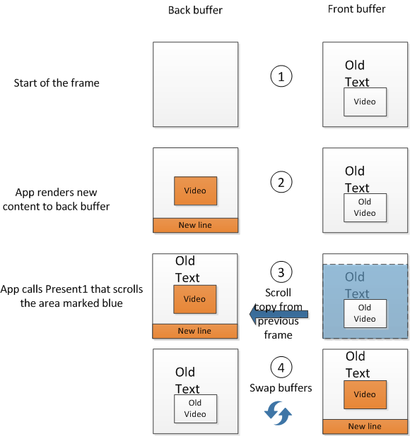
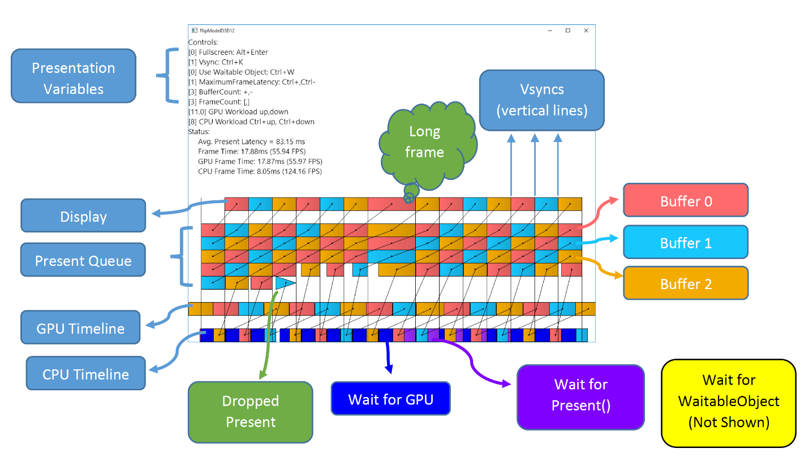

# DirectX

> <https://learn.microsoft.com/en-us/windows/win32/directx>

DirectX 包含了多套 API 用于增强图形和游戏的交互，其中最主要的就是 Direct3D

## COM

> <https://learn.microsoft.com/en-us/windows/win32/prog-dx-with-com>

DirectX API 是基于 COM 的

- 对象都直接或间接由工厂构造，构造时需要指定抽象接口的 GUID `__uuidof(IDXGIFactory2)`
- 仅通过抽象接口与具体对象进行交互，可以尝试扩展或转换接口 `IUnknown::QueryInterface`
- 利用 COM 智能指针管理对象生命周期 `#include <wrl/client.h>` `Microsoft::WRL::ComPtr`
- 返回结果均为 `HRESULT`，可以使用宏 `SUCCEEDED` 和 `FAILED` 来检测结果

## DXGI

> <https://learn.microsoft.com/en-us/windows/win32/direct3ddxgi/d3d10-graphics-programming-guide-dxgi>

从 Direct3D 10 开始，Direct3D 利用 DXGI 作为中间层来与显卡内核驱动交互

- `IDXGIFactory`
  - `IDXGIAdapter`：代表显卡
    - `IDXGIOutput`：代表显示器
    - `IDXGIDevice`：负责与显卡交互
      - `IDXGISwapChain`：负责与窗口交互
      - `IDXGIResource`：代表显存资源

> - 不要混用 DXGI 1.0 (IDXGIFactory) 和 DXGI 1.1 (IDXGIFactory1)
> - 不要在 DllMain 中调用 DXGI
> - 当渲染线程和窗口线程分开时，渲染线程可能会同步等待窗口线程 (SendMessage)，注意避免死锁

以下情况可能会触发错误 `DXGI_ERROR_DEVICE_REMOVED` 或 `DXGI_ERROR_DEVICE_RESET`

- 显卡驱动升级
- 系统切换使用显卡
- 显卡未响应或被重置
- 显卡被插入或移除

可以在调用 `IDXGISwapChain::Present` 和 `WM_SIZE` -> `IDXGISwapChain::ResizeBuffers` 后检测并处理，届时需要销毁所有 DXGI 资源并重新创建

### Device

`IDXGIDevice` 通常使用 `D3D11CreateDevice`/`D3D12CreateDevice` 这些 D3D API 来构造，`ID3D11Device`/`ID3D12Device` 均实现了 `IDXGIDevice` 接口

在 D3D API 中

- `ID3D11Device`/`ID3D12Device` 负责创建资源对象
- D3D11 中 `ID3D11DeviceContext` 负责录制并在适当时机自动提交 GPU 指令
- D3D12 中则更加底层，`ID3D12CommandList` 负责录制 GPU 指令，`ID3D12CommandQueue` 负责提交指令，不同的 CommandQueue 负责提交不同的指令（比如图形、拷贝、计算等）

### SwapChian

> <https://learn.microsoft.com/en-us/windows/win32/direct3ddxgi/d3d10-graphics-programming-guide-dxgi>  
> <https://jackmin.home.blog/2018/12/14/swapchains-present-and-present-latency/>  
> <https://www.intel.com/content/www/us/en/developer/articles/code-sample/sample-application-for-direct3d-12-flip-model-swap-chains.html>

SwapChain 新的构造函数（如 `IDXGIFactory2::CreateSwapChainForHwnd`）通常需要如下步骤

- D3D11

  1. `ID3D11Device::QueryInterface`
  2. `IDXGIDevice::GetAdapter`
  3. `IDXGIAdapter::GetParent`
  4. `IDXGIFactory2::CreateSwapChainForHwnd`

- D3D12
  1. `ID3D12Device::GetAdapterLuid`
  2. `IDXGIFactory4::EnumAdapterByLuid`
  3. `IDXGIAdapter::GetParent`
  4. `IDXGIFactory2::CreateSwapChainForHwnd`

SwapChain 有若干个缓冲区，通常会将其中一个作为渲染目标，渲染完成后会将缓冲区内容输出到窗口

- `IDXGIFactory::MakeWindowAssociation`：监听窗口消息，`Alt+Enter` 切换全屏模式，`Print-Screen` 截屏
- `IDXGISwapChain::SetFullscreenState`：切换全屏模式，通常良好的步骤如下
  1. `IDXGISwapChain::GetContainingOutput` 选择一个合适的屏幕
  2. `IDXGIOutput::FindClosestMatchingMode` 选择一个合适的屏幕分辨率
  3. `IDXGISwapChain::ResizeTarget` 调整窗口大小/屏幕分辨率
  4. 触发 `WM_SIZE` 消息
     1. 释放所有 SwapChain 相关的 Buffer
     2. `IDXGISwapChain::ResizeBuffers` 调整 Buffer 大小
     3. 重新获取 SwapChain 相关的 Buffer
  5. `IDXGISwapChain::SetFullscreenState` 切换全屏模式

> - `DXGI_SWAP_CHAIN_FLAG_ALLOW_MODE_SWITCH` 该创建标志使得全屏模式下调用 `IDXGISwapChain::ResizeTarget` 会自动设置屏幕分辨率
> - 全屏模式下如果 Target 大小和 Buffer 大小不匹配，则 Flip 模式会退化为 Blt 模式
> - 有窗口遮挡时自动退出全屏
> - 注意退出全屏模式后再释放 SwapChain

SwapChain 有两种工作模式与 DWM(Desktop Window Manager) 交互：新的 Flip 和旧的 Blt

Blt 模式下（指定 `DXGI_SWAP_EFFECT_DISCARD` 或 `DXGI_SWAP_EFFECT_SEQUENTIAL`），SwapChain 的后缓冲区需要先位块传输到 DWM 中的前缓冲区，再进行窗口合成，然后显示到屏幕。

Flip 模式下（指定 `DXGI_SWAP_EFFECT_FLIP_SEQUENTIAL` 或 `DXGI_SWAP_EFFECT_FLIP_DISCARD`），SwapChain 的所有缓冲区与 DWM 共享，所以节约了一次复制，但是当缓冲区正在被使用时（比如用作渲染目标） DWM 会跳过读取该帧，所以 Flip 模式下 SwapChain 至少需要 2 个缓冲区。

SwapChain 提交缓冲区给 DWM 时可以使用 `IDXGISwapChain1::Present1` 的增量更新功能，即脏矩形和滚动区域

但是当同时渲染多帧时，前面的帧还未输出（即前缓冲区中的帧不是逻辑的上一帧），则除了从前缓冲区拷贝帧内容，还需要从逻辑的上一帧所在的缓冲区拷贝帧内容，包括脏矩形的差异区域

Blt 模式本身就没有前缓冲区，自然无法从前缓冲区拷贝帧内容，所以 Blt 模式增量更新原理和多帧渲染相同。且 Blt 模式无法使用滚动区域，除此之外多重采样无法与增量更新同时使用。

完整渲染工作流程（以窗口化 Flip 模式为例）：

1. CPU 阶段：CPU 录制用于渲染当前帧的指令（比如图形、拷贝、计算等）并提交到 GPU

2. CPU Present 阶段：当命令队列超过最大值时，`Present` 等待上帧渲染完成再提交

3. GPU 阶段：GPU 开始渲染当前帧并将结果写入 Back Buffer 并交换到 Front Buffer

4. DWM 阶段：等到下个 VBLANK 时 DWM 被唤醒然后读取应用的 Front Buffer 进行合成，并将最终渲染结果输出到自己的 Front Buffer

5. Display 阶段：等到下个 VBLANK 时通过 DAC 将 DWM 的 Front Buffer 输出到屏幕

> - 可以利用 Swapchain Waitable Object 来将 CPU Present 阶段的延迟提前到 CPU 阶段之前从而降低帧内延迟，代价是可能降低 FPS
>
> - 利用全屏模式或全屏窗口可以降低 DWM 引入的延迟，因为此时直接将应用的 Front Buffer 输出到屏幕
>
> - 全屏时若缓冲区内容同时被读取到屏幕和写入渲染结果，则会出现画面撕裂，考虑以下 Nvidia 设置中的权衡
>   - Off：关闭垂直同步，高 FPS，低延迟，但可能出现画面撕裂
>   - On：开启垂直同步，低 FPS，高延迟（FPS 低于刷新率更明显），解决画面撕裂
>   - Fast：关闭垂直同步，但当渲染帧率超过屏幕刷新率则丢弃多余帧
>   - Adaptive：开启垂直同步，但当渲染帧率低于屏幕刷新率时关闭
>   - Adaptive2：开启垂直同步，但帧率限制为屏幕刷新率的一半
