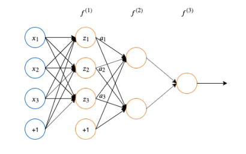
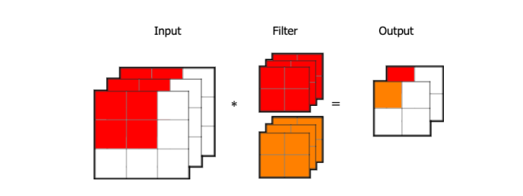
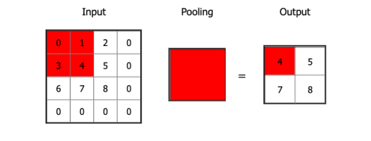
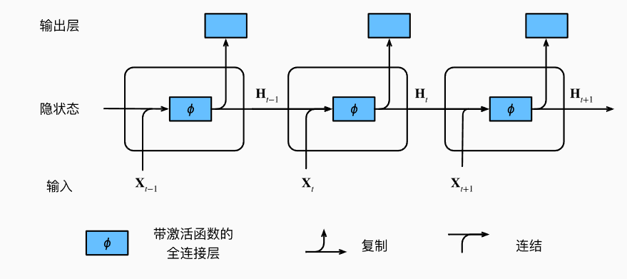

# 深度学习

- [深度学习](#深度学习)
  - [多层感知机](#多层感知机)
    - [输入层](#输入层)
    - [隐含层](#隐含层)
    - [输出层](#输出层)
    - [后向传播](#后向传播)
  - [卷积神经网络](#卷积神经网络)
    - [卷积层](#卷积层)
    - [池化层](#池化层)
  - [循环神经网络](#循环神经网络)
  - [Pytorch 框架](#pytorch-框架)
    - [Tensor](#tensor)
    - [Dataset](#dataset)
    - [Model](#model)
    - [Optimizer](#optimizer)
    - [Loss Function](#loss-function)
    - [Training Loop](#training-loop)
    - [Performance Tuning](#performance-tuning)
    - [Overfitting Solution](#overfitting-solution)
    - [Hyperparams Optimization](#hyperparams-optimization)

## 多层感知机

> 万能近似定理：⼀个前馈神经⽹络如果具有线性层和⾄少⼀层具有 “挤压” 性质的激活函数（如 sigmoid 等），给定⽹络⾜够数量的隐藏单元，它可以以任意精度来近似任何从⼀个有限维空间到另⼀个有限维空间的 borel 可测函数。

多层感知机(Multilayer Perceptron, MLP)，也叫深度前馈网络(Deep Feedforward Network, DFN)或前馈神经网络(Feedforward Neural Network, FNN)。网络包含输入层、隐含层、输出层，层与层之间是全连接的。



### 输入层

通常输入数据是二维张量（样本，特征）

### 隐含层


$\sigma$是激活函数，如果不引入激活函数，可以验证，无论多少层神经网络，
输出都是输入的线性组合。常见激活函数有

- ReLU: $g(z)=max\{0,z\}$
- tanh: $g(z)=\frac{e^z-e^{-z}}{e^z+e^{-z}}$
- sigmoid: $g(z)=\frac{1}{1+e^{-z}}$

### 输出层

假设前⾯已经使⽤若⼲隐藏层提供了⼀组隐藏特征 $h$，输出层的任务就是要对这些特征做⼀些额外变换。常见输出单元有

- linear: $\hat{y}=z=Wh+b$
- softmax: $\hat{y}_i=\frac{exp(z_i)}{\sum_jexp(z_j)}$
- sigmoid: $\hat{y}=\frac{1}{1+exp(-z)}$

### 后向传播

> 关于后向传播算法见 [3Blue1Brown@youtube](https://www.youtube.com/watch?v=Ilg3gGewQ5U&t=464s)

任何能够衡量模型预测值与真实值之间的差异的函数都可以叫做代价函数；通过链式求导与梯度下降可从后往前优化代价函数的参数。

## 卷积神经网络

通常输入为 4 维张量（样本，通道，高度，宽度）

### 卷积层

> 稀疏交互、参数共享、等变表示



- 填充：为防止边缘像素参与卷积运算次数过少，对边缘进行 0 填充
- 步幅：每次移动卷积核的距离
- 核：通常是三维张量（通道，高度，宽度），通道数等于输入数据的通道数，核的数量等于输出数据的通道数
- 卷积：每个核将局部像素信息提取出来

### 池化层

> 降低卷积层对位置的敏感性，同时降低对空间降采样表示的敏感性



- 池化运算
  - Max
  - Average

## 循环神经网络



输入形状：（步长，批量，特征）通常需要转置（批量，步长）后独热编码

## Pytorch 框架

[完整的训练代码示例](https://github.com/mrbeardad/pytorch_example/blob/master/main.py)

### Tensor

```python
import torch

torch.arange(5)
torch.arange(1, 4)
torch.arange(1, 2.5, 0.5)
torch.zeros(2, 3)
torch.ones(2, 3)
torch.full((2, 3), 3.14)
torch.rand(2, 3)
torch.randint(3, 10, (2, 3))
torch.randn(2, 3)
x = torch.tensor([[1, 2, 3], [4, 5, 6]], dtype=torch.float, device="cuda")

x.shape  # torch.Size([2, 3])
x.dtype  # torch.float32
x.device # gpu

x = x.reshape(-1)
x = x.to(torch.int)
x = x.to("cpu")

x[0]     # first row, 降维 dim=0
x[:, 0]  # first column, 降维 dim=1
x[...,-1]# last column, 降维 dim=1
```

### Dataset

```python
from torch.utils.data import Dataset, DataLoader
from torchvision import datasets, transforms

class CustomDataset(Dataset):
    def __init__(self, root, transform=None, target_transform=None):
        pass

    def __len__(self):
        pass

    def __getitem__(self, idx):
        pass


# Dataset 迭代元素为一个样例数据 (X, y)
train_data = datasets.FashionMNIST(
    root="data",                    # 数据目录
    train=True,                     # 训练集 or 测试集
    download=True,                  # 数据不存在则联网下载
    transform=transforms.ToTensor() # 将图片转换为张量并缩放至[0,1]
)

# DataLoader 迭代元素为一个 mini-batch 的所有样例数据 (X, y)
train_loader = DataLoader(
    train_data,               # 绑定 Dataset
    batch_size,               # mini-batch 大小
    shuffle=True,             # 每次循环是否打乱顺序
)
```

### Model

```python
from torch import nn

class MyNeuralNetwork(nn.Module):
    def __init__(self):
        super().__init__()
        self.flatten = nn.Flatten()
        self.net = nn.Sequential(
            nn.Linear(28 * 28, 512),
            nn.BatchNorm1d(512)
            nn.ReLU(),
            nn.Dropout(),
            nn.Linear(512, 10),
        )

    def forward(self, x):
        x = self.flatten(x)
        return self.net(x)

model = MyNeuralNetwork()
```

- Hidden Layers

  - `0`: 只能表示线性可分函数或决策
  - `1`: 可以近似任何包含从一个有限空间到另一个有限空间的连续映射的函数
  - `2`: 可以用有理激活函数以任意精度表示任意决策边界，并且可以近似任何平滑映射到任何精度
  - `>2`: 额外的隐藏层可以学习复杂的描述（某种自动特征工程）

- Hidden Neurons

  - `input * 2 / 3 + output`
  - `(input + output) / 2`
  - `sqrt(input * output)`

- Structed Pruning

  - 提高运算速度
  - 提高泛化能力

- Convolution Layer
  - $n_o=\frac{(n_i-f+2p)}{s}+1$
  - valid: 不填充
  - same: 填充使得卷积后输出大小与输入一致
  - full: 填充使得输出大小为 n+f-1

### Optimizer

```python
torch.optim.AdamW(model.parameters(), lr=1e-3, weight_decay=1e-2, amsgrad=True)
```

### Loss Function

```python
# Regression
nn.SmoothL1Loss(beta=1.0) # 绝对元素误差小于 beta 则使用 MSELoss，其他情况使用 L1Loss

# Multi-Class Classification
nn.CrossEntropyLoss() # 多远分类利用 Softmax(logits) 获取概率

# Binary Classification
nn.BCEWithLogitsLoss() # 二元分类利用 Sigmoid(logits) 获取概率
```

### Training Loop

```python
# 模型有两种模式：
# model.train() 训练时使用，Dropout 与 BatchNorm 等会生效
# model.eval() 测试或推理时使用，Dropout 与 BatchNorm 等不生效

# Pytorch 全局模式有三种：
# Grad Mode: 默认模式，此模式下设置了`requires_grad=True`的张量为记录操作图用于计算梯度
# No-Grad Mode: 此模式下不再记录操作图，可加速测试或推理
# Inference Mode: 同 No-Grad Mode 但更极端，且此模式下创建的张量无法用于其他模式

model.train()
for i in range(epochs):
    for x, y in dataloader:
        # 将张量拷贝到 GPU
        x = x.to("cuda", non_blocking=True)
        y = y.to("cuda", non_blocking=True)

        optimizer.zero_grad(set_to_none=True) # 将累加的梯度归零
        y_hat = model(x) # 前向传播
        loss = criterion(y_hat, y) # 计算损失标准
        loss.backward() # 计算梯度并累加到模型参数张量的.grad字段
        optimizer.step() # 梯度下降优化权重参数

model.eval()
with torch.no_grad():
    for x, y in dataloader:
        x = x.to("cuda", non_blocking=True)
        y = y.to("cuda", non_blocking=True)
        y_hat = model(x)
```

### Performance Tuning

- 数据归一化 `transforms.ToTensor()` `nn.BatchNormd1(...)`
- 异步加载数据 `DataLoader(..., num_workers=1, ...)`
- 固定内存 `DataLoader(..., pin_memory=True, ...)`
- 使用 GPU 加速 `model.to("cuda")` `tensor.to("cuda")`
- 减少不必要梯度计算 `torch.no_grad()` `torch.inference_mode()`
- 加速优化函数 `torch.optim.AdamW(..., fuse=True, ...)`
- JIT 编译 `torch.compile(model)`
- channels_last memory format & Automatic Mixed Precision (Require Tensor Core)

### Overfitting Solution

- Add more training data
- Data Augmentations
- Batch Size: 4 ~ 512，越小泛化能力越强，但训练成本也越高
- Early Stopping: 验证损失持续不下降则停止训练
- Batch Normalisation: 放在激活函数前
- Dropout: 20% ~ 50%, 越大正则化能力越强。放在激活函数后
- L1 and L2 Regularization: 1e-3 ~ 1e-4，越大正则化能力越强

### Hyperparams Optimization

```language
pip install optuna
```

- Batch Size
- Learning Rate
- Weight Decay
- Model Architecture
