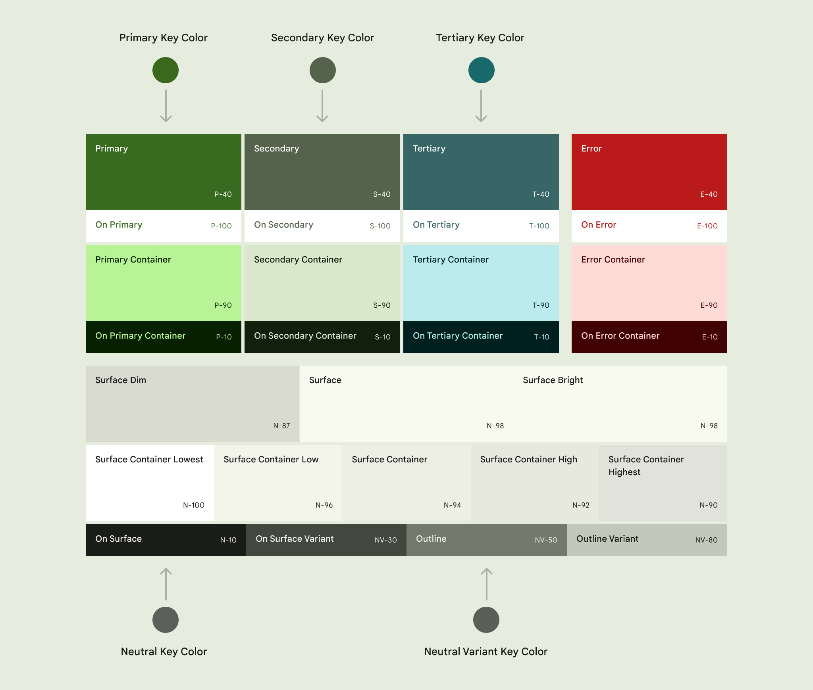

# Material Design

- [Material Design](#material-design)
  - [内容](#内容)
  - [颜色](#颜色)
  - [组件](#组件)

## 内容

- 标点符号

  - 逗号：使用连续逗号，如`emails, chats, and drafts`
  - 句号：只有正文内容才需要句号，其他 UI 元素中的内容无需句号
  - 感叹号：小心使用感叹号，它带有强烈情绪色彩
  - 省略号：省略号只能用来表示未完成的任务或不完整的文本

- 句式

  - 任何文本内容使用句子式大写首字母
  - 强调用户行为的后果，尽量避免潜在影响用户行为，如`Are you sure you want to move to trash?`

- 人称代词

  - 使用第二人称代词指代用户，如`Your mail isn't available`
  - 使用第一人称代词指代用户仅当强调用户自身行为时，如`I agree to the terms of service`
  - 避免使用第一人称代词指代产品本身将其拟人化，如`We're glad you're our customer`

## 颜色

- Accent Colors
  - Primary: 用于跨 UI 的关键组件，如 FAB、AppBar 等
  - Secondary: 用于 UI 中不太突出的组件，如 Chips 等
  - Tertiary: 用于平衡主色辅色，或提高元素关注度
  - Tertiary-Container: 同上，但相对不太需要强调
  - On-Tertiay: 用于在 Tertiay 上显示的内容
  - On-Tertiary-Container: 用于在 Tertiay-Container 上显示的内容
- Error: 用于警告或报错
- Neutral Colors
  - Surface: 用于一片区域的背景色
  - Surface Container: 用于区分相邻或嵌套区域的对比色
  - On-Surface: 用于显示内容的前景色
  - On-Surface-Variant: 同上，但相对不太需要强调
  - Outline: 用于创建边界和重点以提高可用性
  - Outline-Variant: 用于创建装饰性的边界

## 组件

- 整体布局：

  - NavigationBar
  - NavigationRail
  - NavigationDrawer
  - AppBar
  - Tabs

- 行为触发：

  - **High emphasis**
    - Extended FAB
    - FAB
    - Filled button
  - **Medium emphasis**
    - Filled tonal button
    - Elevated button
    - Outlined button
  - **Low emphasis**
    - Text button
    - Segmented button
    - Icon button

- 信息展开：
  - Dialog
  - BottomSheet
  - Menu
  - Snackbar
  - Tooltip
