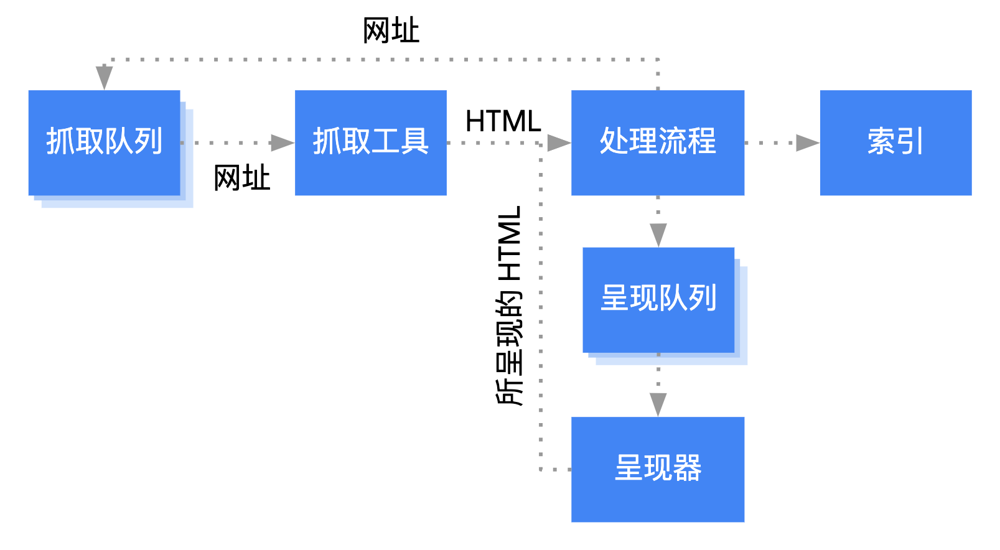

# 搜索引擎优化

## 工作流程



> 搜索引擎首先需要发现新域名和新页面

## 抓取与索引

### 优化

- 对于复杂的大型网站，可提供[站点地图](https://developers.google.com/search/docs/advanced/sitemaps/overview)

  ```html
  <?xml version="1.0" encoding="UTF-8"?>
  <urlset xmlns="http://www.sitemaps.org/schemas/sitemap/0.9">
    <url>
      <loc>http://www.example.com/</loc>
      <lastmod>2005-01-01</lastmod>
      <changefreq>monthly</changefreq>
      <priority>0.8</priority>
    </url>
  </urlset>
  ```

- 对于国际化网站，相同页面存在不同语言翻译版本：

  ```html
  <link rel="alternate" href="https://example.com/" hreflang="x-default" />
  <link rel="alternate" href="https://example.com/" hreflang="zh-CN" />
  ```

- 对于重复的网址：

  - HTML 标签元素：`<link rel="canonical" href="https://www.example.com/canonical" />`
  - HTTP 响应首部：`Link: <http://www.example.com/canonical.pdf>; rel="canonical"`
  - 301 永久重定向
  - 尽量保持 URL 结构简单，且每个 URL 尽量都对应唯一的内容，避免内容重复

- 保证页面语义精确且完整

  ```html
  <title>精简的页面标题</title>
  <meta name="description" content="简短的网站摘要" />

  <a href="https://example.com">语义链接</a>
  
  ```

### 避免

- robots.txt 限制抓取流量

  - `*`表示匹配 0 次或无数次有效字符
  - `$`结尾表示网址结束
  - `/`结尾表示匹配目录
  - 规则冲突时使用最宽限原则

  ```txt
  # robots.txt必须位于根目录，且仅限制抓取 Same-Origin 的资源
  # 每组命令以 User-agent 行开头
  # 至少包含一个 User-agent 行
  # 至少包含一条 Disallow 或 Allow 命令
  User-agent: Googlebot
  User-agent: AdsBot-Google
  Disallow: /nogooglebot/ # Disallow 命令必须以 / 开头

  User-agent: *
  Allow: /

  # 指定站点地图
  Sitemap: http://www.example.com/sitemap.xml
  ```

- 阻止跟踪不可信的出站链接可避免潜在的搜索引擎降权

  ```html
  <a rel="sponsored,ugc,nofollow" href="https://external.com">外部链接链接</a>
  ```

- 阻止将当前页面编入索引

  - HTML 标签元素：`<meta name="robots" content="noindex" />`
  - HTTP 响应首部：`X-Robots-Tag: noindex`

## 呈现

用户搜索结果与数百个因素有关，比如用户位置、语言和使用设备等等。
你可以控制如何呈现搜索结果

详情参见 [google 搜索结果呈现主题概览](https://developers.google.com/search/docs/advanced/appearance/overview)
