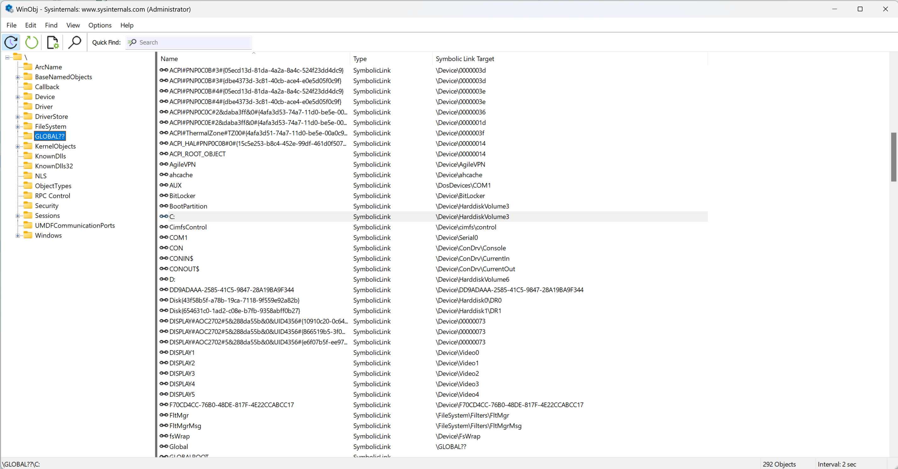
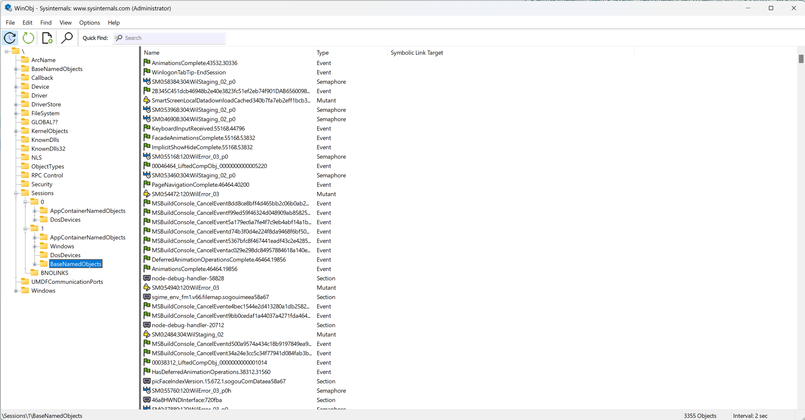
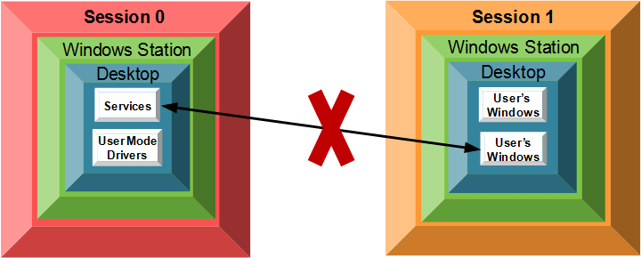
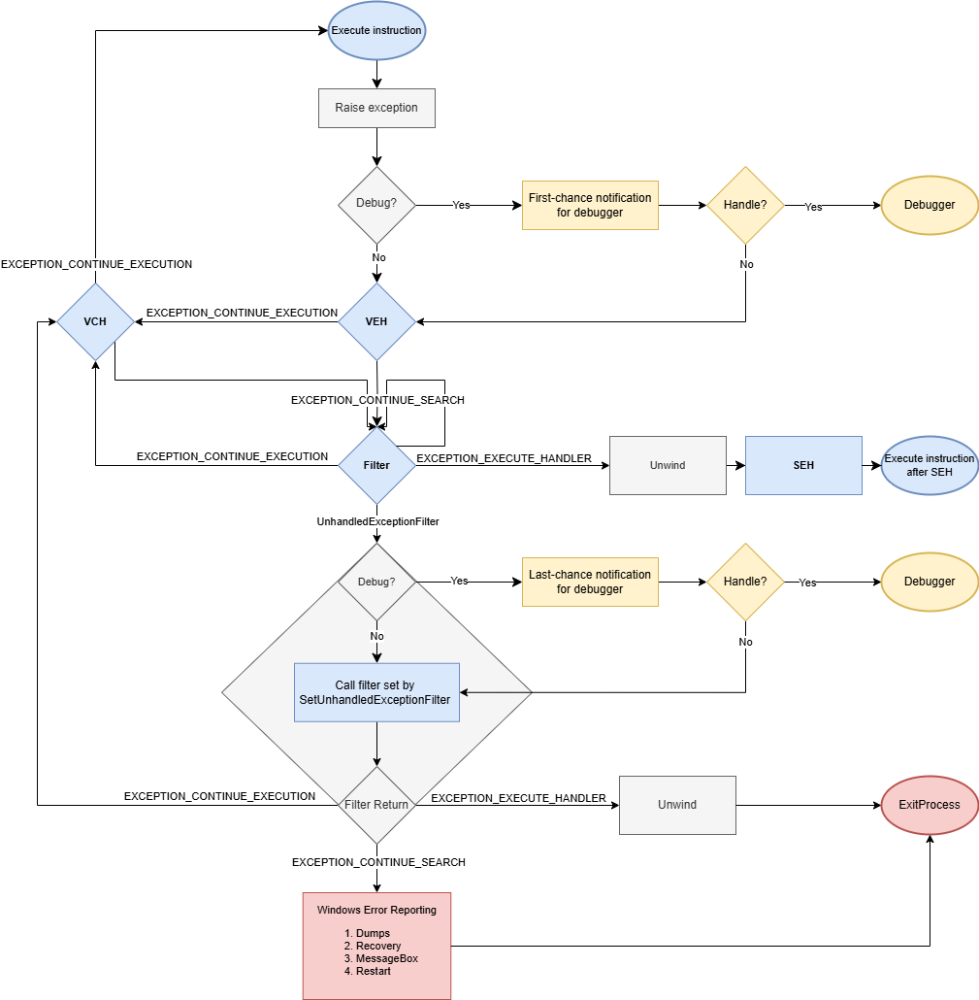
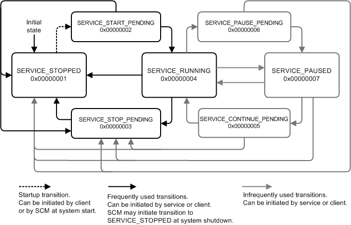
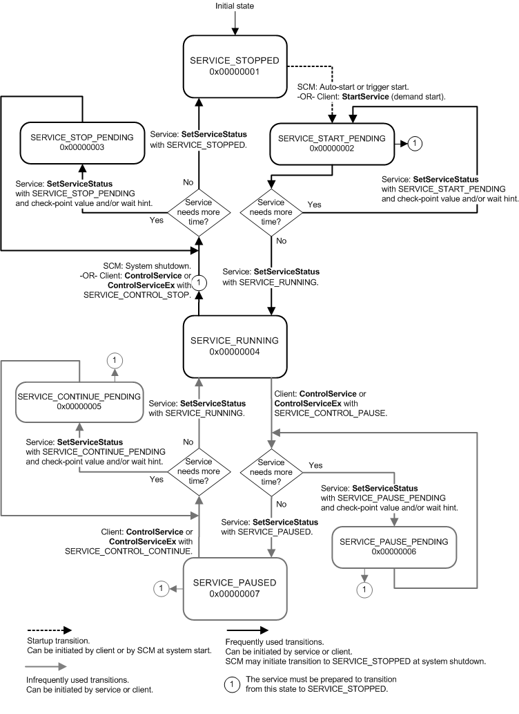
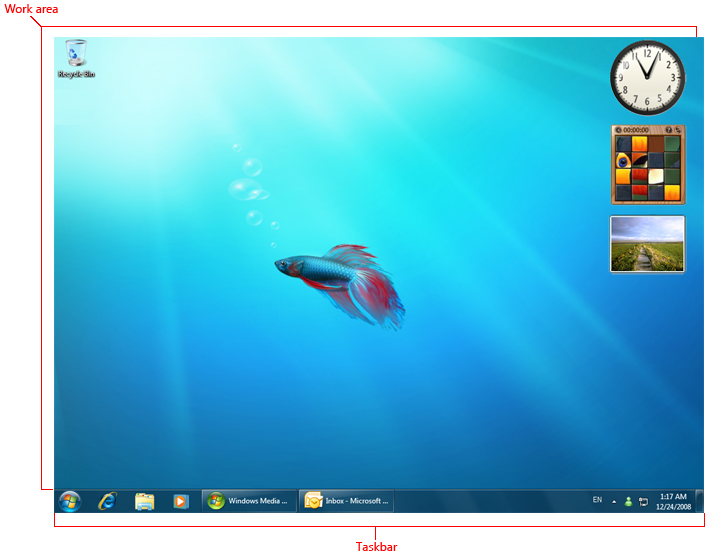
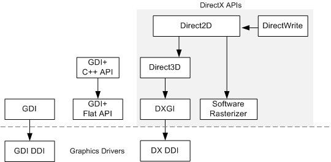
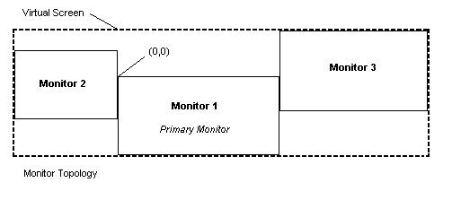
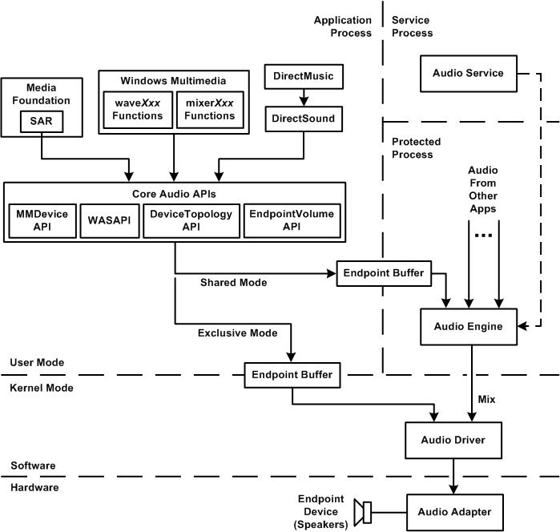

# Win32

- [Win32](#win32)
  - [资源系统](#资源系统)
    - [对象](#对象)
    - [句柄表](#句柄表)
    - [命名空间](#命名空间)
    - [访问控制](#访问控制)
      - [隔离性](#隔离性)
      - [访问控制模型](#访问控制模型)
      - [强制可信控制](#强制可信控制)
      - [用户访问控制](#用户访问控制)
  - [进程系统](#进程系统)
    - [进程管理](#进程管理)
      - [进程创建](#进程创建)
      - [进程继承](#进程继承)
      - [进程终止](#进程终止)
      - [作业](#作业)
    - [线程管理](#线程管理)
      - [线程创建](#线程创建)
      - [线程终止](#线程终止)
      - [线程调度](#线程调度)
        - [上下文切换](#上下文切换)
        - [基本优先级](#基本优先级)
        - [动态优先级](#动态优先级)
        - [服务质量](#服务质量)
        - [CPU 亲和性](#cpu-亲和性)
        - [同步阻塞](#同步阻塞)
    - [模块管理](#模块管理)
      - [模块构建](#模块构建)
      - [生命周期](#生命周期)
      - [搜索路径](#搜索路径)
      - [应用部署](#应用部署)
    - [虚拟内存](#虚拟内存)
    - [异常处理](#异常处理)
    - [服务管理](#服务管理)
  - [IO 系统](#io-系统)
    - [注册表](#注册表)
    - [文件系统](#文件系统)
      - [磁盘](#磁盘)
      - [目录结构](#目录结构)
      - [文件](#文件)
      - [路径](#路径)
      - [读写](#读写)
    - [IPC 机制](#ipc-机制)
      - [套接字](#套接字)
      - [管道](#管道)
      - [数据拷贝](#数据拷贝)
      - [共享内存](#共享内存)
      - [总结](#总结)
    - [异步 IO](#异步-io)
  - [UI 系统](#ui-系统)
    - [桌面结构](#桌面结构)
    - [窗口状态](#窗口状态)
      - [创建窗口](#创建窗口)
      - [窗口类型](#窗口类型)
      - [非客户区样式](#非客户区样式)
      - [窗口名](#窗口名)
      - [位置与大小](#位置与大小)
      - [Z 轴顺序](#z-轴顺序)
      - [前台激活](#前台激活)
      - [最大化与最小化](#最大化与最小化)
      - [显示或隐藏](#显示或隐藏)
      - [启用或禁用](#启用或禁用)
      - [透明背景](#透明背景)
      - [窗口属性](#窗口属性)
    - [窗口消息](#窗口消息)
      - [消息队列](#消息队列)
      - [窗口过程](#窗口过程)
      - [窗口挂钩](#窗口挂钩)
      - [键盘输入](#键盘输入)
      - [鼠标输入](#鼠标输入)
      - [原始输入](#原始输入)
      - [输入法编辑](#输入法编辑)
    - [窗口渲染](#窗口渲染)
      - [GDI](#gdi)
      - [DWM](#dwm)
    - [原生控件](#原生控件)
    - [窗口杂项](#窗口杂项)
      - [系统设置](#系统设置)
      - [多显示器](#多显示器)
      - [高 DPI](#高-dpi)
      - [剪切板](#剪切板)
  - [其他](#其他)
    - [头文件](#头文件)
    - [编译资源](#编译资源)
    - [字符集](#字符集)
    - [音视频](#音视频)

## 资源系统

### 对象

从资源的角度来说, 程序本质可看做对资源的访问和计算, Windows 系统将资源抽象成对象

- [Kernel Object](https://learn.microsoft.com/en-us/windows/win32/sysinfo/kernel-objects)

  - 负责计算和 IO 资源的访问, 如 Process, Thread, Mutex, FileMapping, File 等
  - 一个内核对象可以创建多个句柄, 只要创建的进程具有对象名字和访问权限
  - 内核对象在最后一个句柄关闭后才会销毁, 进程终止时会自动关闭进程持有的内核对象句柄

- [User Object](https://learn.microsoft.com/en-us/windows/win32/sysinfo/user-objects)

  - 负责窗口资源的访问, 如 Window, Menu, Hook, Icon, Cursor 等
  - 一个用户对象只能创建一个句柄, 但句柄是公开的, 只要进程属于同一 Desktop 且具有句柄值和访问权限就能访问
  - 用户对象在调用相应销毁函数后立即被销毁, 进程终止时会自动销毁进程创建的用户对象, 特别的, Window, Hook 等资源在创建线程终止时就被销毁

- [GDI Object](https://learn.microsoft.com/en-us/windows/win32/sysinfo/gdi-objects)
  - 负责图形资源的访问, 如 Bitmap, Brush, Font, DC 等
  - 一个 GDI 对象只能创建一个句柄, 且仅能在创建进程内部访问
  - GDI 对象在调用相应销毁函数后立即被销毁, 进程终止时会自动销毁进程创建的用户对象

其中, 内核对象作为最主要的资源对象, 系统为其提供许多机制来加强管理

### 句柄表

每个进程维护一张句柄表用于访问内核对象, 内核对象句柄仅在进程内有效

- 索引: `HANDLE`
  - 0, -1 保留作为无效句柄
  - 1, 2, 3 保留用作标准输入输出
- 内核对象指针
  - 名字
  - 引用计数
  - 安全描述符
  - ...
- 访问掩码: 该句柄的访问权限掩码
- 属性标志: 如 Protect, Inherit 等

> - `GetHandleInformation`
> - `SetHandleInformation`
> - `CompareObjectHandles`
> - `DuplicateHandle`
> - `CloseHandle`

### 命名空间

大多数内核对象都可以通过名字访问, 所有对象都实际存在于底层 NT 命名空间内, 但不同类型的对象名字处于不同的子命名空间内. 可以使用 [WinObj](https://learn.microsoft.com/en-us/sysinternals/downloads/winobj) 查看详细内容

- 文件相关的内核对象
  - 文件路径名均位于 `\GLOBAL??`
  - 其内包含
    - `C:` 链接到 `\Device\HarddiskVolume3`
    - `GLOBALROOT` 链接到 `\`



- 其它内核对象

  - 不同会话中创建的对象默认位于不同命名空间
    - 服务会话 (session 0) 默认位于 `\BaseNamedObjects`
    - 终端会话 (如 session 1) 默认位于 `\Sessions\1\BaseNamedObjects`
  - 这些命名空间内都存在两个符号链接
    - `Global` 链接到 `\BaseNamedObjects`, 用于跨会话共享
    - `Local` 链接到 `\Session\1\BaseNamedObjects`, 用于不跨会话共享



### 访问控制

#### 隔离性

> 参考 [Window Stations and Desktops](https://learn.microsoft.com/en-us/windows/win32/winstation/window-stations-and-desktops)



- Session: 包含单个用户登录会话产生的所有进程和内核对象

  - Session 0 由系统创建专门用于运行服务 (Services)
  - 不同会话的部分内核对象的默认命名空间不同

- Window Station: 包含一个剪切板、一张原子表和若干 desktop

  - WinSta0 由系统创建, 唯一能与用户终端设备交互的 Window Station
  - 同一 Window Station 内仅允许一个 Desktop 访问用户终端设备

- Desktop: 包含若干 windows, menus, hooks 等用户对象

  - Winlogon 用于用户登录和 UAC 授权
  - Default 用于用户应用程序
  - ScreenSaver 用于屏保
  - windows, menu, hooks 等用户对象仅能在同一 Desktop 内部访问

#### 访问控制模型

> 参考
>
> - [Access Tokens](https://learn.microsoft.com/en-us/windows/win32/secauthz/access-tokens)
> - [Security Descriptors](https://learn.microsoft.com/en-us/windows/win32/secauthz/security-descriptors)
> - [Access Control Lists](https://learn.microsoft.com/en-us/windows/win32/secauthz/access-control-lists)
> - [Access Control Entries](https://learn.microsoft.com/en-us/windows/win32/secauthz/access-control-entries)
> - [Access Rights and Access Masks](https://learn.microsoft.com/en-us/windows/win32/secauthz/access-rights-and-access-masks)
> - [Security Identifiers](https://learn.microsoft.com/en-us/windows/win32/secauthz/security-identifiers)
> - [Privileges](https://learn.microsoft.com/en-us/windows/win32/secauthz/privileges)
> - [Client Impersonation](https://learn.microsoft.com/en-us/windows/win32/secauthz/client-impersonation)

- 访问令牌 (Access Token)

  - user SID
  - group SIDs
  - logon SID
  - privileges LUIDs
  - owner SID
  - primary group SID
  - integrity SIDs
  - default DACL
  - restricting SIDs
  - whether impersonation
  - ...

- 安全描述符 (Security Descriptor)

  - owner SID
  - primary group SID
  - DACL
  - SACL
  - ...

- 访问控制列表 (Access Control Lists)

  - 访问控制表项 (Access Control Entries)
    - trustee SID
    - type flag
    - inherit flags
    - access mask
      - Generic Access Rights: 被映射到 Object-specific Access Right
      - SACL Access Right: 访问对象 SACL 的权限
      - Standard Access Rights: 用于控制对对象本身的操作
        - `DELETE`
        - `READ_CONTROL`
        - `SYNCHRONIZE`
        - `WRITE_DAC`
        - `WRITE_OWNER`
      - Object-specific Access Right: 针对不同类型对象的特殊操作的权限


- 安全对象的访问控制流程
  1. 若没有 DACL, 则允许所有访问
  2. 若存在 DACL, 则使用第一个匹配的 ACE 访问控制, 若没有匹配的 ACE 则拒绝所有访问
  3. 根据 SACL 是否记录该访问尝试

#### 强制可信控制

> 参考
>
> - [Mandatory Integrity Control](https://learn.microsoft.com/en-us/windows/win32/secauthz/mandatory-integrity-control)
> - [Windows Integrity Mechanism Design](<https://learn.microsoft.com/en-us/previous-versions/dotnet/articles/bb625963(v=msdn.10)>)
> - [Allow UIAccess](https://learn.microsoft.com/en-us/previous-versions/windows/it-pro/windows-10/security/threat-protection/security-policy-settings/user-account-control-allow-uiaccess-applications-to-prompt-for-elevation-without-using-the-secure-desktop)

- 可信级别 (Integrity Level)

  - system: 通常为系统服务
  - high: 通常为管理员权限进程
  - medium: 通常为标准用户权限进程
  - low: 通常显式设置了 exe 文件的 security descriptors 或进程的 access token
  - untrust: 同上, 但级别更低

- access token 中的 integrity SIDs 表示可信级别

- security descriptors 中的 SACL 中存储可信级别和强制策略

- ACM: 可信级别校验发生在 DACL 校验之前, 默认拒绝较低可信级别的写入访问

- Privileges: 某些系统特权仅允许高可信级别进程运行

- UIPI: 限制低可信级别对高可信级别的访问机制
  - 验证窗口句柄
  - 发送窗口消息 (API 调用返回成功, 消息被静默丢弃)
  - Hooks
  - DLL 注入
  - 除非应用程序具有 UIAccess 标志且满足以下条件, 则允许对高可信级别进程驱动 UI 自动化
    - 程序具有可信的数字签名
    - 程序安装在 `%ProgramFiles%` 或 `%WinDir%` (某些标准用户可写的子目录除外) 目录下

#### 用户访问控制

用户访问控制 (UAC) 让标准用户不用重新登录就能使用管理员权限

- Administrator Broker Model: 使用 `ShellExecute` 创建管理员权限的新进程
- Operating System Service Model: 使用 IPC 与 Service 通信
- Elevated Task Model: 使用 Task Scheduler 服务运行应用程序

## 进程系统

- 操作系统提供了“进程”与“线程”的概念, 简化了程序对系统中“计算资源”的使用, 如 CPU 和内存等。

- 进程是系统进行内存资源分配的基本单位, 一个进程具有唯一的进程标识符、优先级类、虚拟地址空间、异常处理程序、内核对象句柄、安全上下文、环境变量、命令行参数等, 并且至少有一个执行线程。

- 线程是系统进行 CPU 资源分配的基本单位, 同一进程中所有线程共享虚拟地址空间等进程资源, 此外每个线程负责维护自己的唯一的线程标识符、线程优先级、线程本地存储、线程上下文等。

### 进程管理

> 参考 [Processes and Threads](https://learn.microsoft.com/en-us/windows/win32/procthread/processes-and-threads)

#### 进程创建

1. `CreateProcess`

   - 对于 GUI 程序, 可控制子进程第一次调用 `CreateWindow` 和 `ShowWindow` 的默认参数, 如位置、大小、nCmdShow 等
   - 对于 CUI 程序, 可控制子进程的控制台窗口的句柄、位置、大小等

2. C Run-Time library (CRT) 入口函数, 负责初始化全局变量等, 然后调用用户程序入口函数

3. 用户程序入口函数

   - `main` for **SUBSYSTEM:CONSOLE**, 默认继承父进程控制台窗口或自动创建新控制台窗口
   - `WinMain` for **SUBSYSTEM:WINDOWS**

   ```cpp
   int main(int argc, char* argv[], char* env[]);

   int APIENTRY WinMain(HINSTANCE hInst, HINSTANCE hPrevInstance, PSTR lpCmdLine, int nShowCmd);
   ```

- EXE 搜索路径 (仅当指定无路径的文件名时)

1. 进程 exe 文件所在目录
2. 进程当前目录
3. 32 位 Windows 系统目录 (`C:\Windows\System32`)
4. 16 位 Windows 系统目录 (`C:\Windows\System`)
5. Windows 系统目录 (`C:\Windows`)
6. 环境变量 PATH

> - `CreateProcess`
> - `OpenProcess`
> - `GetProcessId`
> - `GetCurrentProcess`: 伪句柄, 仅进程内有效
> - `GetCurrentProcessId`
> - `EnumProcesses`
> - `GetCommandLine`
> - `CommandLineToArgv`
> - `GetEnvironmentStrings`: 格式为 `Var0=Value0\0Var1=Value1\0\0`
> - `FreeEnvironmentStrings`
> - `ExpandEnvironmentStrings`: 扩展替换变量如 `%USERPROFILE%`
> - `GetEnvironmentVariable`
> - `SetEnvironmentVariable`
> - `GetCurrentDirectory`
> - `SetCurrentDirectory`

#### 进程继承

- 子进程**可以**继承父进程如下属性

  - 环境变量
  - 当前目录
  - 控制台
  - 内核对象句柄 (句柄标志 `bInheritHandle` 且创建进程参数 `bInheritHandles` 都设置为 `true`)
  - 错误模式
  - 进程 CPU 亲和性 (`dwCreationFlags` 设置 `INHERIT_PARENT_AFFINITY`)
  - 作业

- 子进程**不可**继承父进程如下属性

  - 用户对象和 GDI 对象的句柄
  - 伪句柄
  - 虚拟地址空间
  - 优先级类

> - `SetHandleInformation`
> - `UpdateProcThreadAttribute`

#### 进程终止

- 进程终止原因

  - `ExitProcess`

    - 进程中最后一个线程终止 (默认 CRT 实现主线程退出时终止进程)
    - 用户模式中发生的硬件异常或软件异常未被捕获处理时
    - 调用 `ExitWindowsEx` 时
      - [用户注销或关机时](https://learn.microsoft.com/en-us/windows/win32/shutdown/shutting-down)
      - 内核模式中发生的硬件异常或软件异常未被捕获时 (蓝屏)

  - `TerminateProcess`

- 进程终止结果

  1. 终止进程内所有线程, 并释放线程资源
  2. 主线程退出前, 卸载所有动态模块
  3. 释放其他进程资源, 如关闭内核对象句柄
  4. 设置进程退出码
  5. 触发进程对象

- C++ 静态生命周期的变量
  - 仅能保证同一编译单元中的构造和析构顺序, 且析构顺序与构造顺序相反
  - 构造
    1. `static` (模块加载)
    2. `thread_local` (线程加载)
    3. in-block `static`/`thread_local` (首次调用函数)
  - 析构
    1. `thread_load` (线程退出)
    2. in-block `thread_local` (线程退出)
    3. `std::atexit` 保证在注册时就已初始化的任何 `static` 销毁之前调用
    4. `static` (模块卸载)
    5. in-block `static` (模块卸载)
  - **注意: 无法保证变量的析构函数一定会被调用**

> - `ExitProcess`
> - `TerminateProcess`
> - `GetExitCodeProcess`
> - `SetProcessShutdownParameters`: 设置关机时终止优先级

#### 作业

作业用来管理一组进程, 进程关联作业后不可再取消

- 控制子进程的作业继承
  - `JOB_OBJECT_LIMIT_BREAKAWAY_OK`
  - `JOB_OBJECT_LIMIT_SILENT_BREAKAWAY_OK`
- 限制资源访问
  - `JOBOBJECT_BASIC_LIMIT_INFORMATION`
  - `JOBOBJECT_BASIC_UI_RESTRICTIONS`
  - `JOBOBJECT_CPU_RATE_CONTROL_INFORMATION`
  - `JOBOBJECT_EXTENDED_LIMIT_INFORMATION`
  - `JOBOBJECT_NOTIFICATION_LIMIT_INFORMATION`
- 监视进程状态
  - `JOBOBJECT_ASSOCIATE_COMPLETION_PORT`
- 资源使用情况
  - `JOBOBJECT_BASIC_ACCOUNTING_INFORMATION`
  - `JOBOBJECT_BASIC_AND_IO_ACCOUNTING_INFORMATION`
- 作业对象销毁时终止作业内所有进程
  - `JOB_OBJECT_LIMIT_KILL_ON_JOB_CLOSE`

> - `CreateJobObject`
> - `OpenJobObject`
> - `SetInfomationJobObject`
> - `QueryInfomationJobObject`
> - `AssignProcessToJobObject`
> - `TerminateJobOnject`
> - `IsProcessInJob`

### 线程管理

> 参考 [Processes and Threads](https://learn.microsoft.com/en-us/windows/win32/procthread/processes-and-threads)

#### 线程创建

- **若线程函数需要访问 CRT, 则应该使用 `_beginthreadex` 而非 `CreateThread` 来保证线程安全**
- 线程栈最大默认 1M, 可通过控制编译时链接器参数或运行时 `CreateThread` 参数来改变, 大小向上取整 1M

> - `CreateThread`: 安全属性、栈大小、暂停状态
> - `CreateRemoteThread`: 在其他进程中创建线程
> - `OpenThread`
> - `GetThreadId`
> - `GetCurrentThread`: 伪句柄, 仅进程内有效, 使用 `DuplicateHandle` 转换为真句柄
> - `GetCurrentThreadId`

#### 线程终止

- 线程终止原因

  - `ExitThread`
    - 线程函数返回
  - `ExitProcess`
  - `TerminateThread`
  - `TerminateProcess`

- 线程终止结果
  - 释放线程拥有的资源, 如 TLS (Thread Local Storage), windows, hooks 等
  - 设置线程退出码
  - 触发线程对象
  - 如果线程是进程里唯一的线程, 则终止进程

> - `ExitThread`
> - `TerminateThread`
> - `GetExitCodeThread`

#### 线程调度

##### 上下文切换

- 上下文切换原因
  - 时间片到期, 大概 20 ms
  - 主动放弃剩余时间片
  - 被高优先级线程抢占
  - 进入同步等待状态或暂停状态

> - `SuspendThread`
> - `ResumeThread`
> - `Sleep`
> - `SwitchToThread`: 相对 `Sleep(0)`, 允许切换低优先级线程
> - `GetThreadTimes`
> - `GetProcessTimes`

##### 基本优先级

|                               | IDLE_PRIORITY_CLASS | BELOW_NORMAL_PRIORITY_CLASS | NORMAL_PRIORITY_CLASS | ABOVE_NORMAL_PRIORITY_CLASS | HIGH_PRIORITY_CLASS | REALTIME_PRIORITY_CLASS |
| ----------------------------- | ------------------- | --------------------------- | --------------------- | --------------------------- | ------------------- | ----------------------- |
| THREAD_PRIORITY_IDLE          | 1                   | 1                           | 1                     | 1                           | 1                   | 16                      |
| THREAD_PRIORITY_LOWEST        | 2                   | 4                           | 6                     | 8                           | 11                  | 22                      |
| THREAD_PRIORITY_BELOW_NORMAL  | 3                   | 5                           | 7                     | 9                           | 12                  | 23                      |
| THREAD_PRIORITY_NORMAL        | 4                   | 6                           | 8                     | 10                          | 13                  | 24                      |
| THREAD_PRIORITY_ABOVE_NORMAL  | 5                   | 7                           | 9                     | 11                          | 14                  | 25                      |
| THREAD_PRIORITY_HIGHEST       | 6                   | 8                           | 10                    | 12                          | 15                  | 26                      |
| THREAD_PRIORITY_TIME_CRITICAL | 15                  | 15                          | 15                    | 15                          | 15                  | 31                      |

- 通过设置进程优先级和线程优先级, 系统确认线程使用的基本优先级
- 基本优先级 0 保留给 zero-page thread, 它负责将 free page 置零
- 注意 `REALTIME_PRIORITY_CLASS` 优先级会中断系统线程, 比如键鼠输入、磁盘冲刷等

> - `GetPriorityClass`
> - `SetPriorityClass`
> - `GetThreadPriority`
> - `SetThreadPriority`

##### 动态优先级

- 动态优先级用来最终确认线程的执行优先级
- 系统在以下情况会动态提升基本优先级 0 - 15 的线程
  - `NORMAL_PRIORITY_CLASS` 优先级的进程成为前台进程时, 提升其优先级大于或等于任何后台进程
  - 当窗口接受到用户输入时, 提升窗口所属的线程的优先级
  - 当线程同步等待的条件被满足时, 提升该线程的优先级
  - 优先级反转: 高优先级线程等待低优先级线程的资源, 而中优先级线程一直抢占低优先级线程, 导致高优先级线程被中优先级线程阻塞。系统会自动检测这种情况, 并动态提升低优先级线程至所有等待它的线程中的最大优先级
  - 当低优先级线程长时间处于饥饿状态, 提升该线程的优先级
- 动态提升之后, 动态优先级每个时间片降低 1 级, 且绝不低于基本优先级

> - `GetProcessPriorityBoost`
> - `SetProcessPriorityBoost`
> - `GetThreadPriorityBoost`
> - `SetThreadPriorityBoost`

##### 服务质量

服务质量 (Quality of Service) 会影响线程运行的处理器核心和功率, 具体见 [QoS](https://learn.microsoft.com/en-us/windows/win32/procthread/quality-of-service)

##### CPU 亲和性

> 参考
>
> - [Processor Groups](https://learn.microsoft.com/en-us/windows/win32/procthread/processor-groups)
> - [CPU Sets](https://learn.microsoft.com/en-us/windows/win32/procthread/cpu-sets)

利用 CPU 亲和性可以限制进程或线程运行在制定的 CPU 上

- 操作系统可包含多个物理处理器 (physical processor)
- 物理处理器可包含多个核心 (core)
- 核心可包含多个逻辑处理器 (logical processor)
- 每 64 个逻辑处理器为一个处理器组 (processor group)
- Windows 11 之后线程可以跨多个处理器组, 默认优先在主组中运行

##### 同步阻塞

- 为什么需要同步？
  - 保护共享数据被同时读写
  - 等待某个事件发生
- 用户模式
  - [联锁变量](https://learn.microsoft.com/en-us/windows/win32/sync/interlocked-variable-access)
  - [关键段](https://learn.microsoft.com/en-us/windows/win32/sync/critical-section-objects)
  - [读写锁](https://learn.microsoft.com/en-us/windows/win32/sync/slim-reader-writer--srw--locks)
  - [条件变量](https://learn.microsoft.com/en-us/windows/win32/sync/condition-variables)
  - [屏障](https://learn.microsoft.com/en-us/windows/win32/sync/synchronization-barriers)
- 内核模式
  - [互斥量](https://learn.microsoft.com/en-us/windows/win32/sync/mutex-objects): 等于 0 时为触发状态, 等于 TID 时为非触发状态
  - [信号量](https://learn.microsoft.com/en-us/windows/win32/sync/semaphore-objects): 大于 0 时为触发状态, 等于 0 时为非触发状态
  - [事件](https://learn.microsoft.com/en-us/windows/win32/sync/event-objects)
  - [计时器](https://learn.microsoft.com/en-us/windows/win32/sync/waitable-timer-objects)
  - 进程
  - 线程
  - ...

> - `WaitForSingleObjectEx`
> - `WaitForMultipleObjectsEx`
> - `MsgWaitForMultipleObjectsEx`
> - `SignalObjectAndWait`

### 模块管理

> 参考 [Dynamic-Link Libraries](https://learn.microsoft.com/en-us/windows/win32/dlls/dynamic-link-libraries)

#### 模块构建

```cpp
// mydll.h
#pragma once

#ifdef MYDLL_EXPORT
#define MYDLL_API __declspec(dllexport) // dll 实现文件中使用
#else
#define MYDLL_API __declspec(dllimport) // 用户文件中使用
#endif

#ifdef __cplusplus
extern "C" { // 使用 __cdecl 调用约定, 且禁用名称篡改
#endif

MYDLL_API int my_func1(LPCWSTR lpszMsg);

MYDLL_API int __stdcall my_func2(LPCWSTR lpszMsg); // 使用 __stdcall 调用约定和名称篡改

#ifdef __cplusplus
} // extern "C"
#endif
```

#### 生命周期

1. 动态链接:
   - 加载时, 即创建进程时, 此时仅保证 Kernel32.dll 已被加载
   - 运行时, 即调用 `LoadLibrary` 时, 注意提前卸载模块可能导致某些地方仍在使用模块内的函数
2. 内存映射
3. 符号解析
4. 调用 CRT 动态库入口, 负责构造和析构全局变量等
5. 调用 DllMain

   ```cpp
   /*
    * 进程内所有 DllMain 的执行都需要获取同一个互斥锁 (进程唯一)
    * 所以谨慎在 DllMain 中调用 LoadLibrary, FreeLibrary, CreateThread, ExitThread 等函数
   */
   BOOL WINAPI DllMain(HINSTANCE hinstDLL, DWORD fdwReason, LPVOID lpvReserved) {
     switch (fdwReason) {
       case DLL_PROCESS_ATTACH:
         // 首次加载时, 根据加载方式的不同:
         // - 加载时动态链接: 在主线程执行, lpvReserved 为 non-NULL, 返回 FALSE 表示发生错误而终止进程
         // - 运行时动态链接: 在调用 LoadLibrary 的线程执行, lpvReserved 为 NULL, 返回 FALSE 表示 LoadLibrary 返回 FALSE
         break;
       case DLL_PROCESS_DETACH:
         // 模块卸载时, 根据卸载方式的不同:
         // - 进程退出: 在调用了 ExitProcess 的线程中执行, lpvReserved 为 non-NULL
         // - 手动卸载: 在调用了 FreeLibrary 的线程中执行, lpvReserved 为 NULL
         // - 注意, 调用了 TerminateThread 或 TerminateProcess 不会调用 DllMain
         break;
       case DLL_THREAD_ATTACH:
         // - 创建新线程时, 在运行其线程函数前执行
         // - 不会在 DLL_PROCESS_ATTACH 的线程执行
         // - 不会在加载时已经存在的线程中执行
         // - 若线程调用了 DisableThreadLibraryCalls 则不会执行
         break;
       case DLL_THREAD_DETACH:
         // - 线程终止时, 在运行其线程函数返回后执行
         // - 可能没有对应的 DLL_THREAD_ATTACH, 因为加载时线程已存在
         // - 若线程调用了 DisableThreadLibraryCalls 则不会执行
         // - 注意, 调用了 TerminateThread 或 TerminateProcess 不会调用 DllMain
         break;
     }
     return TRUE;
   }
   ```

常见问题:

- `LoadLibrary`/`GetModuleHandleEx` 会增加模块引用计数, `FreeLibrary` 会减少模块引用计数
- `_beginthreadex` 会增加启动函数所在的模块的引用计数, 同时在其线程终止时减少对应的引用计数
- 引用计数为 0 时卸载模块, 此时会调用 DllMain
- 同一进程中的所有 DllMain 执行前需要获取同一把互斥锁, 为避免死锁
  - 谨慎在 DllMain 中调用 `LoadLibrary`/`GetModuleHandleEx`/`FreeLibrary`
  - 禁止在 DllMain 中等待线程启动或线程退出
- 如何优雅地卸载模块
  1. 提供 Deinitialize 方法发送请求给 Controller 线程
  2. Controller 线程负责终止其他所有模块相关的线程
  3. 然后 Controller 作为最后一个模块相关线程退出, 不要调用 `ExitThread` 或 `FreeLibraryAndExitThread` 之类的 Win32 API 退出线程, 否则清理代码不会执行, 比如引用计数不会减少
  4. 最后在 `DllMain DLL_PROCESS_DETACH` 中销毁静态变量 (如果有的话)

> - `LoadLibrary`
> - `LoadLibraryEx`: 可设置修改标准搜索路径、仅加载资源数据, 通常对同一 dll 不能与 `LoadLibrary` 混用
> - `GetProcAddress`
> - `FreeLibrary`
> - `FreeLibraryAndExitThread`
> - `EXTERN_C IMAGE_DOS_HEADER __ImageBase;`: 由链接器创建的变量, 位于该模块的基地址
> - `DisableThreadLibraryCalls`: **线程创建和终止不在调用指定模块的 DllMain, 通常不应该调用此函数因为 CRT 和 TLS 依赖模块的线程通知**
> - `EnumProcessModules`
> - `GetModuleHandle`: 不递增引用计数
> - `GetModuleHandleEx`: 默认递增引用计数
> - `GetModuleFileName`
> - `GetModuleBaseName`
> - `GetWindowModuleFileName`
> - `QueryFullProcessImageName`: 用来获取其它进程的 exe 文件路径更加高效且准确

#### 搜索路径

DLL 标准搜索路径: (当指定相对路径和无路径文件名) , 更详细 DLL 搜索路径见 [Dll search order](https://learn.microsoft.com/en-us/windows/win32/dlls/dynamic-link-library-search-order)

1. DLL Redirection (`app.exe.local`)
2. API sets (`api-*`/`ext-*`)
3. SxS manifest redirection
4. Loaded-module list
5. Known DLLs (`HKEY_LOCAL_MACHINE\SYSTEM\CurrentControlSet\Control\Session Manager\KnownDLLs`)
6. The package dependency graph of the process
7. 进程 exe 所在目录
8. 系统目录 (`C:\Windows\System32`)
9. 16 位兼容系统目录 (`C:\Windows\System`)
10. Windows 目录 (`C:\Windows`)
11. 进程当前目录
12. 环境变量 PATH

#### 应用部署

> 关于 Windows 运行时环境和打包部署建议见 [Deployment](https://learn.microsoft.com/en-us/cpp/windows/deployment-in-visual-cpp?view=msvc-170)

- 部署方案

  - 集中部署: 利用微软提供的部署工具将依赖的 dll 下载并安装到系统目录且随系统升级, 详细教程见 [Redistributing Visual C++ Files](https://learn.microsoft.com/en-us/cpp/windows/redistributing-visual-cpp-files)
  - 本地部署: 将依赖的 dll 放到应用程序目录, 在搜索系统目录之前会先搜索应用程序目录
  - 静态链接: 将依赖用 `/MT` 链接参数静态链接到 exe 或 dll, 可能导致同时使用多个不同版本的库

- [C++ 依赖库](https://learn.microsoft.com/en-us/cpp/c-runtime-library/crt-library-features)
  - `ucrtbase.dll`
    - C 标准库, Windows 10 之后系统自带
    - 其中还包括一些转发 [API Sets](https://learn.microsoft.com/en-us/windows/win32/apiindex/windows-apisets)
    - 位于 `C:\Program Files (x86)\Windows Kits\10\Redist\10.0.22000.0\ucrt\DLLs\`
  - `libcmt.lib`/`msvcrt.lib`
    - 初始化 CRT 的库, 只能静态链接, 两个 lib 分别用于 `/MT` 和 `/MD`
  - `vcruntime<version>.dll`
    - C++ 运行时库, 包含异常处理、调试支持、运行检测等功能
    - `vcruntime140.dll` 是基础库, `vcruntime140_1.dll` 是扩展库, 后者保证与前者的 ABI 兼容
    - 位于 64 和 32 位系统目录
  - `msvcp<version>.dll`
    - C++ 标准库, 包含 STL 等
    - `<version>` 同上
    - 位于 64 和 32 位系统目录

### 虚拟内存

> 参考 [Memory Management](https://learn.microsoft.com/en-us/windows/win32/memory/memory-management)

- 虚拟地址空间

| 分区          | x86                     | x64                                       |
| ------------- | ----------------------- | ----------------------------------------- |
| 空指针赋值区  | 0x00000000 - 0x0000FFFF | 0x00000000'00000000 - 0x00000000'0000FFFF |
| 用户模式分区  | 0x00010000-0x7FFEFFFF   | 0x00000000'00010000 - 0x000007FF'FFFEFFFF |
| 64KB 禁入分区 | 0x7FFF0000 - 0x7FFFFFFF | 0x000007FF'FFFF0000 - 0x000007FF'FFFFFFFF |
| 内核模式分区  | 0x80000000 - 0xFFFFFFFF | 0x00000800'00000000 - 0xFFFFFFFF'FFFFFFFF |

- 页面: CPU 进行虚拟地址翻译的粒度, 故系统进行内存管理和分配的粒度必须是其整数倍, x86/x64 页面大小为 4K, Windows 用户内存分配粒度为 64K

- 页面状态

  - `MEM_FREE`: 该地址尚未被分配, 无法访问
  - `MEM_RESERVE`: 该地址已被分配, 但还未调拨存储器, 无法访问
  - `MEM_COMMIT`: 该地址已被分配, 且已调拨存储器 (storage), 第一次访问时系统会为其准备物理内存页面和对应数据

- 页面类型

  - `MEM_PRIVATE`:
    - 后备存储器为页交换文件 (paging file)
    - 第一次访问时无需从页交换文件中加载页面, 直接申请物理内存页面并置零
  - `MEM_IMAGE`:
    - 后备存储器为映像文件, 如 exe 或 dll,
    - 映像文件为 PE 格式, 内部有多个不同的段, 加载不同的段时会使用不同的页面保护属性
  - `MEM_MAPPED`:
    - 后备存储器可以为页交换文件 (如共享内存) 或其它磁盘文件 (如文件映射)

- 页面保护

  - `PAGE_NOACCESS`
  - `PAGE_READONLY`
  - `PAGE_READWRITE`
  - `PAGE_WRITECOPY`
  - `PAGE_EXECUTE`
  - `PAGE_EXECUTE_READ`
  - `PAGE_EXECUTE_READWRITE`
  - `PAGE_EXECUTE_WRITECOPY`
  - `PAGE_GUARD`: 设置一次性内存访问异常处理

- 地址访问

  1. CPU 中的内存管理单元 (MMU) 负责根据页表基址寄存器 (PTBR) 存储的页表基址从翻译后备缓冲器 (TLB) 获取虚拟地址对应的页表表项 (PTE) 从而翻译为物理地址

  2. 操作系统为每个进程维护一个多级页表, 最后一级页表表项记录虚拟地址对应的物理地址, 其它级页表表项记录下一级页表基地址, 通常只有一级页表常驻内存

  3. 根据页表索引到页面的物理地址后, 有以下两种情况
     - 对应页面已经在内存中, 说明该页面在此之前已经被本进程或其它进程访问过了
     - 对应页面没有在内存中, 说明该页面可能是第一次访问, 或之前被冲刷到后备存储器了
       1. 触发缺页异常, 控制流转到操作系统异常处理程序
       2. 利用文件系统驱动, 将对应的页面从其后备存储器中加载到内存
       3. 当内存中无空闲页面时, 根据某种缓存驱逐策略来选择使用页面, 若为脏页则先将其冲刷到其后备存储器再使用

- 工作集 (Working Set)

  - 每个进程维护一个工作集, 管理驻留在内存中的页面
  - 最小工作集大小默认 50 个页面
  - 最大工作集大小默认 345 个页面

- 内存池 (Memory Pool)
  - 内核使用的内存分为两种
  - paged pool: 可交换出物理内存。单处理器系统有 3 个, 多处理器系统有 5 个
  - nonpaged pool: 驻留在物理内存中

> - `GetSystemInfo`: CPU 硬件信息
> - `GetPerformanceInfo`: 系统运行时性能信息
> - `GlobalMemoryStatusEx`: 系统内存使用情况
> - `GetProcessMemoryInfo`: 进程内存使用情况
> - `VirtualQuery`
> - `VirtualAlloc`: 控制内存页面状态, 申请[大页内存](https://learn.microsoft.com/en-us/windows/win32/memory/large-page-support)
> - `VirtualFree`
> - `VirtualProtect`
> - `CreateFile`
> - `CreateFileMapping`
> - `MapViewOfFile`
> - `HeapCreate`
> - `HeapDestroy`
> - `HeapAlloc`
> - `HeapFree`
> - `HeapReAlloc`
> - `GetProcessHeap`: 每个进程有一个默认的线程安全的堆
> - `GetProcessHeaps`
> - `GetProcessWorkingSetSize`
> - `SetProcessWorkingSetSize`

### 异常处理

> 参考 [Error Handling](https://learn.microsoft.com/en-us/windows/win32/debug/error-handling)、[Structured Exception Handling](https://learn.microsoft.com/en-us/windows/win32/debug/structured-exception-handling)、[Windows Error Reporting](https://learn.microsoft.com/en-us/windows/win32/wer/windows-error-reporting)

- 返回码: 几乎所有系统 API 的调用都可能会失败, 通常返回特殊的值表示调用失败

  - `BOOL`: 返回 `FALSE` 表示失败
  - `HANDLE`: 返回 `NULL` 或 `INVALID_HANDLE_VALUE` (特别注意)
  - `LPVOID`: 返回 `NULL` 表示失败
  - `HRESULT`: 使用 `SUCCEEDED(hr)` 或 `FAILED(hr)` 来检测成功或失败

- 错误码: 当系统 API 调用失败时 (少数是在调用成功时) 设置一个线程独立的[**错误码**](https://learn.microsoft.com/en-us/windows/win32/debug/system-error-codes)来表示失败 (或成功) 的原因

```cpp
std::string GetLastErrorAsString() {
    std::string message;

    DWORD errorMessageID = ::GetLastError();
    if(errorMessageID == 0) {
        return message;
    }

    LPSTR messageBuffer = nullptr;
    size_t size = FormatMessageA(
        FORMAT_MESSAGE_ALLOCATE_BUFFER | FORMAT_MESSAGE_FROM_SYSTEM | FORMAT_MESSAGE_IGNORE_INSERTS,
        NULL, errorMessageID, MAKELANGID(LANG_NEUTRAL, SUBLANG_DEFAULT), (LPSTR)&messageBuffer, 0,
        NULL);

    if (size) {
      message = std::string(messageBuffer, size);
      LocalFree(messageBuffer);
    }

    return message;
}
```

- 错误模式: 当进程发生严重错误时, 系统默认会显示错误对话框, 对话框会挂起进程 (同步执行)

  - `SEM_FAILCRITICALERRORS`, 不显示对话框转而将错误发送给进程, 通常应该设置改标志
  - `SEM_NOALIGNMENTFAULTEXCEPT`, 在支持的平台上自动修复内存对齐错误
  - `SEM_NOGPFAULTERRORBOX`, 不显示 WER 对话框
  - `SEM_NOOPENFILEERRORBOX`, 不显示当 `OpenFile` 传入 `OF_PROMPT` 标志且对应文件不存在时的对话框

- 结构化异常处理 (SEH): 使用 SEH 后编译器禁止在 `__try` 中构造 C++ 对象, **因为 SEH 的栈展开不会调用析构函数**

```cpp
/*
 * Termination-Handler Syntax
*/
__try {
    // 可以使用 __leave 提前离开 __try 块且避免非正常离开和性能处罚
} __finally {
    // 只要控制流离开 __try 块就会执行 __finally 块, 包括栈展开, 除非因线程终止而离开 __try 块
}

/*
 * Exception-Handler Syntax
*/
__try {
    // 当发生底层的硬件或软件错误时会触发异常, 也可以调用 RaiseException 手动触发
}
// 过滤表达式结果可以是以下值之一:
// EXCEPTION_CONTINUE_EXECUTION 表示继续执行发生异常的指令, 注意可能导致死循环
// EXCEPTION_EXECUTE_HANDLER 表示执行后续 __except 块
// EXCEPTION_CONTINUE_SEARCH 表示搜索外部 __except 块
__except (filter-expression) {
    // 当搜索到能够处理异常的 __except 块时, 先进行栈展开 (unwind) 直到 __excpet 块所在栈帧, 然后继续执行 __except 块
}
```

- 向量化异常处理 (VEH)

  - 在异常触发后且在首次通知调试器后调用
  - 返回 `EXCEPTION_CONTINUE_EXECUTION` 表示继续执行发生异常的指令, 跳过后续 VEH
  - 返回 `EXCEPTION_CONTINUE_SEARCH` 表示执行后续 VEH, 然后开始搜索 SEH

- 向量化继续处理 (VCH)

  - 在继续执行发生异常的指令之前调用
  - 返回 `EXCEPTION_CONTINUE_EXECUTION` 表示继续执行发生异常的指令, 跳过后续 VCH
  - 返回 `EXCEPTION_CONTINUE_SEARCH` 表示执行后续 VCH, 然后从异常指令开始重新搜索 SEH

- 未处理异常

  - `UnhandledExceptionFilter` 作为最外部的全局 SEH 的过滤表达式
  - 其内部会调用 `SetUnhandledExceptionFilter` 设置的过滤函数
  - C++ 程序默认设置了未处理异常过滤函数, 用来过滤 C++ 异常

- Window 错误报告 (WER)
  1. Dumps: 需要设置 `HKEY_LOCAL_MACHINE\Software\Microsoft\Windows\Windows Error Reporting\LocalDumps`
  2. Recovery: 需要调用 `RegisterApplicationRecoveryCallback`
  3. MessageBox: 需要设置 `HKEY_LOCAL_MACHINE\Software\Microsoft\Windows\Windows Error Reporting\DontShowUI` 为 0, 且 `GetErrorMode` 标志没有 `SEM_NOGPFAULTERRORBOX`
  4. Restart: 需要调用`RegisterApplicationRestart`



> - `GetLastError`
> - `SetLastError`
> - `FormatMessage`
> - `GetErrorMode`
> - `SetErrorMode`
> - `GetThreadErrorMode`
> - `SetThreadErrorMode`
> - `_set_se_translator`: 将结构化异常翻译为 C++ 异常从而可以被 `try-catch` 语句捕获
> - `_controlfp_s`: 默认系统关闭所有浮点异常, 因此计算结果可以是 NAN 或 INFINITY 而不是异常。
> - `_clearfp`: 必须在浮点异常处理块中调用该函数来获取并清除浮点异常标志
> - `RaiseException`
> - `GetExceptionCode`: 仅可在过滤表达式和 `__except` 块中调用
> - `GetExceptionInformation`: 仅可在过滤表达式中调用, 因为执行 `__except` 块时异常栈帧已被销毁
> - `AbnormalTermination`: 仅可在 `__finally` 块中调用
> - `AddVectoredExceptionHandler`
> - `RemoveVectoredExceptionHandler`
> - `AddVectoredContinueHandler`
> - `RemoveVectoredContinueHandler`
> - `UnhandledExceptionFilter`
> - `SetUnhandledExceptionFilter`
> - `RegisterApplicationRecoveryCallback`
> - `RegisterApplicationRestart`

### 服务管理

> 参考 [About Services](https://learn.microsoft.com/en-us/windows/win32/services/about-services)

- Service Control Manager

  - 加载顺序
    - 顺序组: HKEY_LOCAL_MACHINE\System\CurrentControlSet\Control\ServiceGroupOrder
    - 组内顺序: HKEY_LOCAL_MACHINE\System\CurrentControlSet\Control\GroupOrderList
    - 依赖顺序
  - last-known-good (LKG) configuration: 每次成功启动系统, 都会将启动配置备份, 当下次启动失败时则使用该备份配置尝试重新启动

- Service Configuration Program

  - `OpenSCManager`
  - `CreateService`
  - `OpenService`
  - `ChangeServiceConfig`
  - `QueryServiceConfig`
  - `DeleteService`
  - `GetServiceKeyName`
  - `GetServiceDisplayName`
  - `EnumServicesStatusEx`
  - `EnumDependentServices`
  - `sc.exe`

- Service Control Program

  - `StartService`
  - `ControlService`
  - `QueryServiceStatusEx`
  - `sc.exe`

- Service Program

  - `StartServiceCtrlDispatcher` -> `ServiceMain` (in new thread)
  - `RegisterServiceCtrlHandlerEx` -> `LPHANDLER_FUNCTION_EX` (in dispatcher thread)
  - `SetServiceStatus`

- User Accounts
  - `NT AUTHORITY\LocalService`
  - `NT AUTHORITY\NetworkService`
  - `LocalSystem`





## IO 系统

操作系统提供了“内核对象”的机制, 简化了程序对系统中“IO 资源”的使用, 如设备、文件、网络、IPC 等。

### 注册表

注册表是 Windows 用来存储配置的层次结构数据库(B-Tree), 支持事务。

- Key: Subkey 和 Value 的集合

  - Name: 不可包含 `\`, 忽略大小写

- Value: 包含数据的记录

  - Name: 可以包含 `\`, 忽略大小写
  - Type
  - Data

- Computer

  - `HKEY_LOCAL_MACHINE`: 系统全局配置
    - `Software`: 软件配置, 32 位程序访问该 Key 会被重定向到 `WOW6432Node`
      - `CLASS`: 文件扩展名配置
    - `WOW6432Node`: 具体见 [Registry Keys Affected by WOW64](https://learn.microsoft.com/en-us/windows/win32/winprog64/shared-registry-keys)
  - `HKEY_CURRENT_USER`: 当前用户配置
    - `Software`: 软件配置, 不会重定向 32 位程序
      - `CLASS`: 文件扩展名配置
    - `Environment`: 用户环境变量
  - `HKEY_CLASSES_ROOT`: 包含 `HKEY_CURRENT_USER\Software\Classes` 和 `HKEY_LOCAL_MACHINE\Software\Classes` 合并后的视图
  - `HKEY_USERS`: 所有用户配置实际所在, `HKEY_CURRENT_USER` 重定向到某子项

> - `RegEnumKeyEx`
> - `RegQueryInfoKey`
> - `RegGetKeySecurity`
> - `RegNotifyChangeKeyValue`
> - `RegOpenKeyExW`
> - `RegOpenCurrentUser`: 打开当前模拟用户的 `HKEY_CURRENT_USER`
> - `RegOpenUserClassesRoot`: 打开当前模拟用户的 `HKEY_CLASSES_ROOT` 视图, 注意需要模拟用户配置已被加载 (比如用户登录) , 使用 `LoadUserProfile` 手动加载
> - `RegCreateKeyEx`
> - `RegDeleteKey`
> - `RegCloseKey`
> - `RegFlushKey`
> - `RegQueryValueEx`
> - `RegQueryMultipleValues`
> - `RegSetValueEx`
> - `RegDeleteValue`
> - `RegSaveKeyEx`: 将注册表条目保存到文件, 注意这不同于 `.reg` 文件 (用 `regedit.exe` 来导入)
> - `RegLoadKey`: 不覆盖已存在的 key, 可以用 `RegUnLoadKey` 还原
> - `RegReplaceKey`: 覆盖已存在的 key
> - `RegRestoreKey`

### 文件系统

> 参考 [File Management](https://learn.microsoft.com/en-us/windows/win32/fileio/file-management)

NTFS 支持事务

#### 磁盘

| 特性         | MBR 分区表                           | GPT 分区表      |
| ------------ | ------------------------------------ | --------------- |
| 适用固件     | BIOS                                 | UEFI            |
| 分区大小     | 最大支持近 2TB                       | 最大支持近 18EB |
| 主分区       | 最多只能有 3 个主分区与 1 个扩展分区 | 全部是主分区    |
| 引导加载器   | 在 MBR 头部以及主分区头部            | 在 ESP 中       |
| 分区表健壮性 | 无校验、 无备份                      | 有校验、有备份  |


> - `FindFirstVolume`
> - `FindNextVolume`
> - `FindVolumeClose`
> - `GetVolumeInformation`
> - `GetDiskFreeSpaceEx`
> - `IDiskQuotaControl`
> - `IEnumDiskQuotaUsers`

#### 目录结构

- **_C:_**
  - Windows `%SystemRoot%`: Window 系统目录
    - System: 16 位兼容系统目录
    - System32: **64 位**系统目录
    - SystemWOW64: **32 位**系统目录, (**W**indows 32-bit **o**n **W**indows **64**-bit)
    - **注意文件系统重定向，对于 32 位程序，System32 被重定向到 SysWOW64，使用 Sysnative 访问真正的 System32**，具体细节见 [File System Redirector](https://learn.microsoft.com/en-us/windows/win32/winprog64/file-system-redirector)
  - Program Files `%ProgramFiles%`: 64 位应用程序安装目录 (所有用户)
  - Program Files (x86) `%ProgramFiles(x86)%`: 32 位应用程序安装目录 (所有用户)
  - Program Data `%ProgramData%`: 应用程序数据 (所有用户)
  - Users
    - username `%USERPROFILE%`
      - AppData
        - Local `%LOCALAPPDATA%`: 应用程序状态数据 (当前用户)
          - Programs: 应用程序安装目录 (当前用户)
          - Temp `%TEMP%`: 应用程序缓存数据（当前用户（
        - Roaming `%APPDATA%`: 应用程序配置数据 (当前用户)

#### 文件

- 文件: 一个文件由若干个文件流组成, 文件流包含了文件的元数据和数据, 引用文件流 `file.txt:strm:$DATA`, 其中 `$DATA` 为流类型 (可忽略) , 可能需要添加路径 `.\` 以防止文件名被解析为盘符

  - 唯一对象标识
  - 安全描述符
  - 重解析点
  - 文件名和属性
    - 文件名
    - 日期时间 (创建、访问、修改)
    - 文件大小 (使用、分配)
    - 只读
    - 隐藏
    - 压缩
    - 加密
    - 可被备份
    - 可被索引
    - ...
  - 文件数据
  - ...

- 链接

  - 硬链接
    - 即目录项, 每个硬链接指向单独的文件流记录“文件名和属性”
    - 不可跨文件系统
  - _软连接 (Junctions)_
    - 利用重解析点, 仅可指向目录
    - 可跨本地文件系统, 不可跨网络文件系统
  - 符号链接
    - 利用重解析点
    - 可跨网络文件系统

> - `FindFirstFile`
> - `FindNextFile`
> - `FindFirstStream`
> - `FindNextStream`
> - `FindClose`
> - `GetFileInformationByHandle`
> - `SetFileInformationByHandle`
> - `GetFileAttributes`
> - `SetFileAttributes`
> - `GetFileType`
> - `GetBinaryType`
> - `GetFileTime`
> - `SetFileTime`
> - `GetFileSize`
> - `CreateFile`
> - `DeleteFile`: 直到最后一个文件句柄被关闭才真正删除文件, 而在此之前文件就无法被打开了
> - `CopyFile`
> - `CopyFileExA`: 可以获取拷贝进度
> - `MoveFile`: 目标路径不能已存在
> - `MoveFileEx`: 可以获取移动进度
> - `ReplaceFile`: 目标路径必须已存在, 仅覆盖数据文件流和少量属性
> - `CreateDirectory`
> - `RemoveDirectory`
> - `ReadDirectoryChangesW`
> - `CreateHardLink`
> - `CreateSymbolicLink`

#### 路径

- 文件名

  - 不能包含特殊字符: `<` `>` `:` `"` `/` `\` `|` `?` `*` `NUL` 控制字符等
  - 不能使用保留名称: CON, PRN, AUX, NUL, COM0, LPT0 等, 即使如 NUL.txt 带扩展名也不行
  - 不能以 `.` 或 `SPC` 结尾
  - 默认忽略大小写

- 路径名

  - 路径是以 `\` 分隔组件名 (卷、目录、文件) 的字符串

  - 相对路径: 如 `file.txt` `.\file.txt` `..\file.txt` `\file.txt` `C:file.txt`

    - 会根据当前卷和当前目录, 或指定卷的当前目录扩展成完全限定路径
    - 限制最大长度为 MAX_PATH (260), 包含末尾 `NUL`
    - 可以使用 `.` `..` `/`

  - 完全限定路径: 如 `C:\file.txt`

    - 限制最大长度为 MAX_PATH (260), 包含末尾 `NUL`
    - 可以使用 `.` `..` `/`

  - Win32 文件命名空间: 如 `\\?\C:\file.txt`

    - 限制最大长度大概为 32767, 包含末尾 `NUL`, 但单个文件名不能超过 255
    - 不能使用 `.` `..` `/`, 且必须为完全限定路径

  - Win32 设备命名空间: 如 `\\.\PhysicalDrive0`

    - 直接指定 NT 命名空间中的 `GLOBAL??` 里的设备对象

> - `GetLongPathName`
> - `GetShortPathName`
> - `GetFullPathName`
> - `GetTempPath2`: 返回路径长度最大 MAX_PATH+1, 不会校验路径是否已存在
> - `GetTempFileName`: 自动或手动创建唯一文件名 `<prefix><uuuu>.TMP`
> - `SHGetKnownFolderPath`

#### 读写

- 以下标志会影响缓存行为

  - `FILE_FLAG_RANDOM_ACCESS`
  - `FILE_FLAG_SEQUENTIAL_SCAN`
  - `FILE_FLAG_NO_BUFFERING`
  - `FILE_FLAG_WRITE_THROUGH`
  - `FILE_ATTRIBUTE_TEMPORARY`

- 创建文件对象时, 会包含一个数据文件流的偏移量, 称为文件指针, 每次调用读写接口都会自动更新指针位置。

> - `ReadFile`
> - `ReadFileEx`
> - `WriteFile`
> - `WriteFileEx`
> - `FlushFileBuffers`
> - `SetFilePointer`
> - `SetEndOfFile`

### IPC 机制

> 参考 [Interprocess communications](https://learn.microsoft.com/en-us/windows/win32/ipc/interprocess-communications)

#### 套接字

- Server

  1. `WSAStartup`
  2. `WSASocket`
  3. `bind`
  4. `listen` (tcp only)
  5. `AcceptEx` (tcp only)
  6. `WSASend`/`WSASendTo`/`WSARecv`/`WSARecvFrom`
  7. `LPFN_DISCONNECTEX` (tcp only)
  8. `closesocket`
  9. `WSACleanup`

- Client

  1. `WSAStartup`
  2. `WSASocket`
  3. `GetAddrInfoEx`
  4. `LPFN_CONNECTEX` (implicit `bind`, tcp only)
  5. `FreeAddrInfoEx`
  6. `WSASend`/`WSASendTo`/`WSARecv`/`WSARecvFrom`
  7. `LPFN_DISCONNECTEX` (tcp only)
  8. `WSARecv`
  9. `closesocket`
  10. `WSACleanup`

> 通过 `WSAIoctl` 可以获取不同的底层 service provider 提供特定的 API

#### 管道

- 匿名管道:
  - 单向通讯
  - 创建后只能通过子进程继承的方式获取 handle
  - 见示例 [Creating a Child Process with Redirected Input and Output](https://learn.microsoft.com/en-us/windows/win32/procthread/creating-a-child-process-with-redirected-input-and-output)

> - `CreatePipe`
> - `GetStdHandle`
> - `SetStdHandle`

- 命名管道:
  - 支持单向和双向
  - 创建后可通过管道名字的方式获取 handle, 如 `\\.\pipe\PipeName`
  - 仅当服务端存在空闲的命名管道实例, 客户端才能打开它
  - 见示例 [Named Pipe Server](https://learn.microsoft.com/en-us/windows/win32/ipc/named-pipe-server-using-overlapped-i-o) 和 [Named Pipe Client](https://learn.microsoft.com/en-us/windows/win32/ipc/named-pipe-client)

> - `CreateNamedPipe`: 服务端创建命名管道
> - `ConnectNamedPipe`: 服务端等待连接, 客户端可能在此之前就打开管道了, 比如在 `CreateNamedPipe` 或 `DisconnectNamedPipe` 之后
> - `DisconnectNamedPipe`: 服务端关闭连接, 使客户端句柄失效 (客户端仍需要调用 CloseHandle) , 同时丢弃缓冲区中的数据
> - `CreateFile`: 客户端连接服务端命名管道
> - `WaitNamedPipe`: 客户端等待服务端空闲管道

#### 数据拷贝

> 参考 [Why can't I PostMessage the WM_COPYDATA message](https://devblogs.microsoft.com/oldnewthing/20110916-00/?p=9623)

```cpp
auto data = COPYDATASTRUCT {
  .dwData = data_type,
  .cbData = data_size,
  .lpData = data_buf,
};

// 系统需要确定何时释放缓冲区, 所以 WM_COPYDATA 只能使用 SendMessage 同步发送消息
SendMessage(target_hwnd, WM_COPYDATA, hwnd, &data);
```

#### 共享内存

> 参考 [Creating Named Shared Memory](https://learn.microsoft.com/en-us/windows/win32/memory/creating-named-shared-memory)
>
> - `CreateFileMapping`
> - `OpenFileMapping`
> - `MapViewOfFile`
> - `UnmapViewOfFile`

#### 总结

- 套接字

  - 每个连接需要单独的 2 对读写缓冲区, 缓冲可以被复用
  - 完善的缓冲区管理和连接管理, 支持流传输
  - 服务端监听网络端口需要设置防火墙规则
  - **适用场景: 跨机器的网络通讯**

- 双向命名管道 (Windows 10 之后支持 [UNIX Domain Socket](https://devblogs.microsoft.com/commandline/af_unix-comes-to-windows/) 可以代替命名管道)

  - 每个连接需要单独的 1 对读写缓冲区, 缓冲可以被复用
  - 有缓冲区管理, 但需要自己完善连接管理 (特别是断开连接会丢弃缓冲区数据), 支持流传输
  - **适用场景: 本机的进程间通讯**

- 数据拷贝

  - 每次发送数据都需要分配缓冲区, 且只能同步发送, 但消息不用排队
  - 有缓冲区管理, 没有连接管理, 不支持流传输
  - **适用场景: UI 同步逻辑通讯**

- 共享内存
  - 可以直接在共享内存中**构造**消息对象, 单次通讯可省去一次拷贝 (构造期间需要加锁, 通常来说构造数据比拷贝更慢)
  - 可以直接在共享内存中**访问并处理**消息对象, 单次通讯可省去一次拷贝 (处理期间需要加锁, 通常来说处理数据比拷贝更慢)
  - 没有缓冲区管理, 没有连接管理, 没有流传输
  - **适用场景: 传输 Raw Data (数据量大且处理快)**

### 异步 IO

> 参考
>
> - [Synchronization and Overlapped Input and Output](https://learn.microsoft.com/en-us/windows/win32/sync/synchronization-and-overlapped-input-and-output)
> - [Asynchronous Procedure Calls](https://learn.microsoft.com/en-us/windows/win32/sync/asynchronous-procedure-calls)
> - [I/O Completion Ports](https://learn.microsoft.com/en-us/windows/win32/fileio/i-o-completion-ports)

Windows 支持三种异步 IO 机制:

- Overlapped IO: 利用可同步对象
- APC: 利用 APC 任务队列
- IOCP: 利用 IOCP 消息队列

其中前两者可以使用同一个多路复用接口 `MsgWaitForMultipleObjectsEx` 一起监听, 而 IOCP 则不行。

- 使用流程

  1. 创建 IOCP `CreateIoCompletionPort` (iocp only)
  2. **创建 HANDLE `CreateFile` 使用 `FILE_FLAG_OVERLAPPED` 标志**
  3. 关联 HANDLE `CreateIoCompletionPort` (iocp only)
  4. **调用异步 IO 接口**
  5. **等待 IO 事件完成** `GetQueuedCompletionStatus`/`WaitForMultipleObjectsEx`
  6. **IO 事件完成, 唤醒等待线程**
     - Overlapped IO
       - 唤醒等待对应 Event 对象的线程
     - APC
       - 唤醒 Alertable 状态的线程并执行对应回调函数
     - IOCP
       - FIFO 顺序通知等待线程
       - IOCP 设置有最大并发数, 超过后阻塞后续等待线程
       - 当线程处于其他阻塞状态时 (如 `SuspendThread` 或 `WaitForMultipleObjectsEx`) , 系统会通知其他线程, 这时如果阻塞线程被唤醒, 则 IOCP 关联线程会超过最大并发数

- Overlapped-IO/IOCP 支持的异步 IO 有:

  - `ReadFile`
  - `WriteFile`
  - `AcceptEx`
  - `LPFN_CONNECTEX`
  - `LPFN_DISCONNECTEX`
  - `WSASend`
  - `WSASendTo`
  - `WSASendMsg`
  - `WSARecv`
  - `WSARecvFrom`
  - `LPFN_WSARECVMSG`
  - `ConnectNamedPipe`
  - `TransactNamedPipe`
  - `WaitCommEvent`
  - `LockFileEx`
  - `DeviceIoControl`
  - `ReadDirectoryChangesW`
  - `PostQueuedCompletionStatus` (iocp only)

- APC 支持的异步 IO 有:

  - `ReadFileEx`
  - `WriteFileEx`
  - `SetWaitableTimer`
  - `SetWaitableTimerEx`
  - `QueueUserAPC`

- 取消异步 IO

  - `CancelIo`
  - `CancelIoEx`

- 线程池
  - `BindIoCompletionCallback`
  - 详细内容见 [Thread Pool API](https://learn.microsoft.com/en-us/windows/win32/procthread/thread-pool-api)

## UI 系统

### 桌面结构

> 参考
>
> - [Window Stations and Desktops](https://learn.microsoft.com/en-us/windows/win32/winstation/window-stations-and-desktops)
> - [The Windows 7 Desktop](https://learn.microsoft.com/en-us/windows/win32/uxguide/winenv-desktop)
> - [Windows and Messages](https://learn.microsoft.com/en-us/windows/win32/winmsg/windowing)
> - [Windows Shell](https://learn.microsoft.com/en-us/windows/win32/shell/shell-entry)




- Desktop Window
  - Taskbar
    - Start Button
    - Taskbar Buttons
      - Icon and Label
      - Overlay Icon
      - Progress Bar
      - Jump List
      - Thumbnail Toolbar
    - Notification Area
      - Icon
      - Tooltip (Hover)
      - Popup Window (Left click)
      - Primary Window (Left double-click)
      - Context Menu (Right-click)
  - Application Window
    
    - Non-Client Area
      - Title Bar
        - Application Icon
        - Window Menu
        - Window Title
        - Minimize and Maximize Button
        - Close Button
      - Menu Bar
      - Border
      - Scroll Bar
    - Client Area

### 窗口状态

#### 创建窗口

```cpp
HWND CreateWindowExW(
  [in]           DWORD     dwExStyle,   // 扩展样式, 控制窗口状态和行为
  [in, optional] LPCWSTR   lpClassName, // 窗口类, 用于控制窗口状态和行为, 通常在多个窗口间共享
  [in, optional] LPCWSTR   lpWindowName,// 窗口名, 用于描述应用, 通常显示在窗口标题栏和任务栏按钮上
  [in]           DWORD     dwStyle,     // 基础样式, 控制窗口状态和行为
  [in]           int       X,           // 窗口左上角位置
  [in]           int       Y,
  [in]           int       nWidth,      // 窗口大小
  [in]           int       nHeight,
  [in, optional] HWND      hWndParent,  // 指定父窗口 (for child window) 或 Owner 窗口 (for top-level window)
  [in, optional] HMENU     hMenu,       // 指定子窗口 ID (for child window) 或 Menu 句柄 (for top-level window)
  [in, optional] HINSTANCE hInstance,   // 指定窗口关联的模块, 用于搜索窗口类
  [in, optional] LPVOID    lpParam      // 窗口自定义数据, 通常将窗口封装成 class 并在这里传递 this 指针
);
```

> - `RegisterClassEx`: 返回 Atom 可以通过宏 MAKEINTATOM 转换当窗口类名来用
> - `UnregisterClassEx`
> - `CreateWindowEx`
> - `IsWindow`: 检测 HWND 是否有效
> - `DestroyWindow`
> - `EndTask`: 先尝试发送 `WM_CLOSE`, 若失败则可以选择强制关闭窗口

MVVM 作为现代流行的 UI 设计模式, 引入了数据驱动的概念, 即 UI 是状态的纯函数, 只要状态数据相同, 呈现的 UI 也一定相同, 通过更改数据来更新 UI

#### 窗口类型

- Top-level Window

  - 条件:
    - `dwStyle` 包含 `WS_OVERLAPPED` 或 `WS_POPUP`
  - 特点:
    - 作为 Desktop Window 的子窗口
    - 若无 Owner 则默认显示 Taskbar Button
      - `WS_EX_APPWINDOW` 强制显示 Taskbar Button
      - `WS_EX_TOOLWINDOW` 强制不显示 Taskbar Button

> - `EnumWindows`
> - `EnumThreadWindows`
> - `FindWindow`: 根据 Window name 和 Class name 查找窗口

- Owned Window

  - 条件:
    - Top-level Window
    - `pWndParent` 为 owner 窗口的 `HWND` (owner 也必须是 Top-level Window)
  - 特点:
    - 总是在 owner 窗口上方
    - 当 owner 窗口最小化时隐藏, 当 owner 窗口恢复时显示
    - 跟随 owner 窗口一起销毁

> - `GetLastActivePopup`
> - `ShowOwnedPopups`
> - `GetWindow`: 可以获取 Owner 窗口

- Child Window

  - 条件:
    - `dwStyle` 包含 `WS_CHILD`
    - `hWndParent` 为父窗口的 `HWND` (不能为 `NULL`)
    - `hMenu` 为自定义子窗口 ID
  - 特点:
    - 总是在父窗口上方
    - 跟随父窗口一同显示/隐藏、移动、销毁
    - 超出父窗口 client area 部分将被裁剪
    - 禁用状态的子窗口的消息直接发送给父窗口

> - `WS_CLIPCHILDREN`: 从该父窗口的绘制区域裁剪掉其子窗口区域, 防止覆盖子窗口
> - `WS_CLIPSIBLINGS`: 从该子窗口的绘制区域裁剪掉其兄弟窗口区域, 防止覆盖兄弟窗口
> - `IsChild`
> - `GetParent`
> - `SetParent`
> - `GetAncestor`
> - `EnumChildWindows`
> - `FindWindowEx`
> - `ChildWindowFromPoint`: 检测坐标属于哪个子窗口
> - `ChildWindowFromPointEx`: 可以跳过某些状态的子窗口
> - `RealChildWindowFromPoint`: 仅检测直系子窗口

- Message-only Window
  - 条件
    - Child Window
    - `hWndParent` 为 `HWND_MESSAGE`
  - 特点
    - 仅用于接受并处理消息, 不会显示

#### 非客户区样式

- `WS_CAPTION`: title bar and unsizing border
- `WS_SYSMENU`: application icon, window menu and close button (requrie `WS_CAPTION`)
- `WS_MINIMIZEBOX`: minimize button
- `WS_MAXIMIZEBOX`: maximize and restore button
- `WS_BORDER`: unsizing border
- `WS_THICKFRAME`: sizing border
- `WS_VSCROLL`: vertical scroll bar
- `WS_HSCROLL`: horizontal scroll bar
- Overlapped
  - `WS_OVERLAPPED`: title bar and unsizing border
  - `WS_OVERLAPPEDWINDOW` = `WS_OVERLAPPED | WS_CAPTION | WS_SYSMENU | WS_MINIMIZEBOX | WS_MAXIMIZEBOX | WS_THICKFRAME`
- Popup
  - `WS_POPUP`: only client area
  - `WS_POPUPWINDOW | WS_CAPTION` = `WS_POPUP | WS_BORDER | WS_SYSMENU | WS_CAPTION`
- Child
  - `WS_CHILD`: only client area (cannot have a menu bar, cannot be used with the `WS_POPUP`)

> - `GetTitleBarInfo`
> - `GetWindowLongPtr`
> - `SetWindowLongPtr`

```cpp
typedef struct tagWNDCLASSEXW {
  UINT      cbSize;         // 该结构体大小
  UINT      style;          // 控制一些绘制行为
  WNDPROC   lpfnWndProc;    // 窗口处理函数
  int       cbClsExtra;     // 通常为 0
  int       cbWndExtra;     // 通常为 0
  HINSTANCE hInstance;      // 该窗口类关联的模块
  HICON     hIcon;          // 图标, 会显示在 start, taskbar, title bar, system tray 等
  HCURSOR   hCursor;        // 鼠标
  HBRUSH    hbrBackground;  // 窗口背景颜色
  LPCWSTR   lpszMenuName;   // 菜单资源名, 通常使用 MAKEINTRESOURCE
  LPCWSTR   lpszClassName;  // 窗口名
  HICON     hIconSm;        // 小图标, 若为空则自动从原图标创建
} WNDCLASSEXW, *PWNDCLASSEXW, *NPWNDCLASSEXW, *LPWNDCLASSEXW;
```

- 创建窗口时会提供窗口类名和模块句柄, 用来搜索对应的窗口类
  1. local class
  2. global class: `style` 设置 `CS_GLOBALCLASS`
  3. system class: 第一次调用窗口函数时创建

> - `RegisterClassEx`
> - `UnregisterClass`
> - `GetClassName`
> - `GetClassInfoEx`
> - `GetClassLongPtr`
> - `SetClassLongPtr`

#### 窗口名

窗口名通常会显示在窗口的 title bar 和 taskbar button 里, 搜索窗口时通常也会用到窗口名

- `GetWindowTextLength`: 对于其他进程中的 Child Window 无效
- `GetWindowText`: 对于其他进程中的 Child Window 无效
- `SetWindowText`: 对于其他进程中的 Child Window 无效
- `WM_GETTEXTLENGTH`
- `WM_GETTEXT`
- `WM_SETTEXT`
- `InternalGetWindowText`: 直接读取结构体获取, 而非上面的接口通过窗口消息, 且保证返回 Unidoe String

#### 位置与大小

Top-level Window 默认使用屏幕坐标系, Child Window 默认使用客户区坐标系


- `WS_CAPTION`: 可以让用户拖动窗口改变位置
- `WS_THICKFRAME`: 可以让用户拖动边框改变大小
- `CW_USEDEFAULT`: 创建窗口时初始位置和大小, 仅对 Overlapped Window 有效, 默认位置基于屏幕左上角偏移
- `GetWindowInfo`
- `GetWindowRect`: 若窗口已经显示过一次, 则返回大小包含边缘阴影 (Windows 10 之后窗口周围存在看不见的 margin 和 padding, 正常大小只有下左右三边存在, 最大化窗口上下左右四边都存在)
- `GetClientRect`
- `WindowFromPoint`
- `ChildWindowFromPoint`
- `ChildWindowFromPointEx`
- `RealChildWindowFromPoint`
- `ClientToScreen`
- `ScreenToClient`
- `MapWindowPoints`
- `AdjustWindowRect`: 根据 client-area 大小和 style 计算窗口大小
- `AdjustWindowRectEx`
- `CalculatePopupWindowPosition`: 计算弹窗位置, 不超出屏幕或 work area
- `MoveWindow`: 改变窗口位置和大小, 并控制窗口绘制
- `SetWindowPos`: (可以异步) 改变窗口位置和大小、Z-Order、显示状态等
- `SetWindowPlacement`: 设置正常、最小化、最大化状态的位置与大小, 还有显示状态
- `BeginDeferWindowPos`
- `DeferWindowPos`: 同时更改多个窗口位置大小、Z-Order、显示状态等
- `EndDeferWindowPos`
- `WM_ENTERSIZEMOVE`: 当点击标题栏 (移动位置) 、边框 (改变大小) 或 `WM_SYSCOMMAND` 处理 `SC_MOVE` 或 `SC_SIZE` 时
- `WM_EXITSIZEMOVE`: 结束以上操作时
- `WM_WINDOWPOSCHANGING`: 当位置、大小、Z-Order、显示/隐藏将要改变时, 对包含 `WS_OVERLAPPED` 和 `WS_THICKFRAME` 样式的窗口额外发送 `WM_GETMINMAXINFO` 消息
- `WM_WINDOWPOSCHANGED`: 当位置、大小、Z-Order、显示/隐藏将要改变时, 若位置或/和大小改变则额外发送 `WM_MOVE` 或/和 `WM_SIZE`

#### Z 轴顺序

- `WS_EX_TOPMOST`: 可将 Z 轴视作 Normal 和 Topmost 两段, Topmost 窗口始终保持在 Normal 窗口和 taskbar 上面
- `GetWindow`: 可以根据 Z-order 获取子窗口
- `GetNextWindow`
- `GetTopWindow`
- `BringWindowToTop`
- `SetWindowPos`: (可以异步) 改变窗口位置和大小、Z-Order、显示状态等
- `CascadeWindows`
- `BeginDeferWindowPos`
- `DeferWindowPos`: 同时更改多个窗口位置大小、Z-Order、显示状态等
- `EndDeferWindowPos`

#### 前台激活

前台窗口 (Foreground Window) 或激活窗口 (Active Window) 指用户当前正在使用的 Top-level 窗口, 即键盘焦点位于该窗口或其子窗口 (通常称为 Focused Window) , 前台激活窗口通常位于 (normal or topmost) Z 轴顶部。将窗口设置为前台窗口需要调用者满足一些[必要条件](https://learn.microsoft.com/en-us/windows/win32/api/winuser/nf-winuser-setforegroundwindow#remarks)。

> 因为[历史原因](https://devblogs.microsoft.com/oldnewthing/20081006-00/?p=20643)导致出现了 foregound 和 active 两个术语。

- `GetLastActivePopup`
- `GetActiveWindow`: 获取前台激活窗口 (仅限当前线程)
- `SetActiveWindow`: 设置前台激活窗口 (仅限当前线程)
- `GetGUIThreadInfo`: 可以获取前台激活窗口 (可以指定其他进程)
- `GetForegroundWindow`
- `SetForegroundWindow`
- `AllowSetForegroundWindow`: 在下次用户输入或下次某进程调用 `AllowSetForegroundWindow` 时失效
- `LockSetForegroundWindow`: 短暂时间后自动解锁
- `WM_ACTIVATEAPP`: 当焦点切换到不同的应用程序时, 发送给涉及的两个应用的所有窗口
- `WM_ACTIVE`: 当窗口聚焦或失焦时发送

激活窗口必须是 Top-level 窗口, 焦点窗口 (Focused Window) 是激活窗口本身或其子窗口

- `GetFocus`
- `SetFocus`
- `WM_KILLFOCUS`
- `WM_SETFOCUS`

#### 最大化与最小化

- `WS_MANIMIZEBOX`: 为用户提供最大化按钮
- `WS_MINIMIZEBOX`: 为用户提供最小化按钮
- `WS_MAXIMIZE`: 创建窗口时设置初始最大化
- `WS_MINIMIZE`: 创建窗口时设置初始最小化
- `IsZoomed`: 窗口是否最大化
- `IsIconic`: 窗口是否最小化
- `CloseWindow`: 最小化窗口
- `OpenIcon`: 从最小化恢复窗口
- `ShowWindow`: 最小化、最大化、恢复、显示、隐藏、默认状态、控制是否前台激活
- `ShowWindowAsync`: 异步 ShowWindow
- `SetWindowPlacement`: 设置正常、最小化、最大化状态的位置与大小, 还有显示状态
- `GetWindowPlacement`

#### 显示或隐藏

若当前进程在被创建时指定了 `STARTUPINFO.wShowWindow` 且 `STARTUPINFO.dwFlag` 包含 `STARTF_USESHOWWINDOW`, 则进程第一次调用 `ShowWindow` 的参数被忽略, 而强制使用父进程指定的参数。

- `WS_VISIBLE`: 创建窗口后自动调用 `ShowWindow(SW_SHOW)`, 对于 Overlapped Window 若 `x` 设置为 `CW_USEDEFAULT` 则 `y` 也需要设置为 `CW_USEDEFAULT` 才有效
- `IsWindowVisible`: `WS_VISIBLE` 仅表示该窗口是否在其父窗口中可见, 而若其父窗口不可见则该窗口也不可见
- `ShowWindow`: 最小化、最大化、恢复、显示、隐藏、默认状态、控制是否前台激活
- `ShowWindowAsync`: 异步 ShowWindow
- `AnimateWindow`: 显示隐藏时展示动画 (仅 client area)
- `ShowOwnedPopups`
- `WM_SHOWWINDOW`

#### 启用或禁用

禁用子窗口导致子窗口的消息被父窗口接收处理, 禁用前台激活窗口导致键盘失焦且不会转移到其他窗口

- `WS_DISABLED`: 创建窗口时设置初始禁用状态
- `IsWindowEnabled`
- `EnableWindow`
- `WM_ENABLE`: `EnableWindow` 返回前发送该消息

#### 透明背景

- `WS_EX_LAYERED`: 窗口支持透明度从而可以实现半透明效果和非矩形窗口, 若 Alpha 通道为 0 则透过鼠标事件
- `WS_EX_TRANSPARENT`: 透过所有鼠标事件
- `SetLayeredWindowAttributes`: 通过图层混合的方式确认最终的窗口像素 Alpha 通道
- `UpdateLayeredWindow`: 直接绘制包含 Alpha 通道的像素纹理

在调用 `SetLayeredWindowAttributes` 或 `UpdateLayeredWindow` 之前窗口不会被绘制, 调用 `SetLayeredWindowAttributes` 设置属性将导致 `UpdateLayeredWindow` 失效, 除非清除设置的属性

#### 窗口属性

除了窗口用户数据 (`CreateWindowEx` 最后一个参数, 可通过 `GetWindowLongPtr` 和 `GetWindowLongPtr` 读写) , 还可以使用窗口属性为窗口附加额外的数据。

- `EnumProps`
- `EnumPropsEx`
- `GetProp`
- `SetProp`
- `RemoveProp`: 通常在 `WM_DESTROY` 消息处理中调用

### 窗口消息

#### 消息队列

> 参考 [About Messages and Message Queues](https://learn.microsoft.com/en-us/windows/win32/winmsg/about-messages-and-message-queues)

当线程第一次调用窗口系统相关函数时, 会创建一个消息队列用来接收消息。该线程创建的窗口的消息都被发送到该线程的消息队列中。

```cpp
MSG msg{};
while (true) {
    auto res = GetMessage(&msg, NULL, 0, 0); // 同步阻塞读取消息队列
    if (res == -1) { // Error
        break;
    }
    if (res == 0) { // WM_QUIT
        break;
    }
    TranslateMessage(&msg); // 将键盘按键消息翻译生成字符消息, 放入消息队列
    DispatchMessage(&msg); // 将消息分派到对应的窗口处理函数
}
```

| 范围             | 描述                                                                    |
| ---------------- | ----------------------------------------------------------------------- |
| 0 ~ WM_USER-1    | 系统保留                                                                |
| WM_USER ~ 0x7FFF | 在窗口类内部使用的自定义消息                                            |
| WM_APP ~ 0xBFFF  | 应用程序内部使用的自定义消息                                            |
| 0xC000 ~ 0xFFFF  | 非以上两者的自定义消息, 调用 `RegisterWindowMessage` 返回以保证系统唯一 |
| 0xFFFF ~         | 系统保留                                                                |

消息可能由系统发送、其他窗口发送、默认处理函数或其他 API 函数创建发送

- `GetMessage`: 同步阻塞读取消息, 可设置消息过滤 (无法过滤 `WM_QUIT`)
- `PeekMessage`: 同步非阻塞读取消息, 可设置消息过滤 (无法过滤 `WM_QUIT`) , 可选择是否从队列中删除消息 (无法删除 `WM_PAINT` 除非更新区域为空)

消息读取的优先级

1. Sent message (内部直接处理, 不会返回消息)
2. Posted message
3. Input (hardware) messages and system internal events
4. Sent messages (again, 内部直接处理, 不会返回消息)
5. `WM_PAINT` 多个消息会合并成一个 (脏区合并)
6. `WM_TIMER`
7. `WM_QUIT`

- `GetMessageTime`: 获取当前消息的创建时间
- `GetMessageCursor`: 获取当前消息创建时的光标位置
- `SendMessage`: 同步发送消息
- `SendMessageTimeout`: 同步发送消息
- `SendNotifyMessage`: 目标窗口同线程则同步发送, 不同线程则异步发送消息
- `SendMessageCallback`: 目标窗口同线程则同步发送, 不同线程则异步发送消息
- `InSendMessageEx`
- `ReplyMessage`: 使消息的同步发送者即刻返回, 不用继续等待
- `PostMessage`: 异步发送消息, 发送到消息队列
- `PostThreadMessage`: 异步发送消息, 指定线程而非指定窗口 (该消息的 `hwnd` 为 `NULL`)
- `PostQuitMessage`: 异步发送 `WM_QUIT`, 该消息无法被忽略
- `ChangeWindowMessageFilter`: 允许低可信级别发送指定到指定进程 (不推荐)
- `ChangeWindowMessageFilterEx`: 允许低可信级别发送指定到指定窗口
- `AttachThreadInput`: 与指定线程共享键鼠输入状态
- `IsGUIThread`

#### 窗口过程

> 参考 [Window Procedures](https://learn.microsoft.com/en-us/windows/win32/winmsg/about-window-procedures)

窗口过程(Window Procdure)或称窗口处理函数, 由窗口类提供。
注意在处理消息时先查看对应的文档, 因为不同消息的参数和返回值的意义不同。

```cpp
LRESULT CALLBACK MainWndProc(
    HWND hwnd,        // 窗口句柄
    UINT uMsg,        // 消息 ID
    WPARAM wParam,    // 消息特定参数 1
    LPARAM lParam)    // 消息特定参数 2
{
    switch (uMsg) {
        case WM_CREATE:
            // client area 创建完成时
            // lParam 指向结构包含窗口创建信息
            // 返回 0 表示正常, 返回 -1 导致 CreateWindowEx 返回 NULL
            return 0;

        case WM_PAINT:
            // 当窗口更新区域不为空时 (如窗口被遮挡或暴露) , 或窗口消息队列无其他消息时, 或调用 UpdateWindow (仅当更新区域不为空时有效)  或 RedrawWindow (仅当设置 RDW_INTERNALPAINT 时有效)
            return 0;

        case WM_CLOSE:
            // 窗口关闭请求, 如点击右上角关闭按钮、任务栏关闭按钮、Alt-F4 快捷键、消息发送等
            // 通常在此调用 DestroyWindow
            return 0;

        case WM_DESTROY:
            // 窗口已被销毁, 此时子窗口还未销毁
            // 通常在此调用 PostQuitMessage
            return 0;

        case WM_QUIT:
            // 通常无法接收到此消息, 因为该消息导致 GetMeesage 返回 0 从而退出消息循环
            return 0;

        default:
            return DefWindowProc(hwnd, uMsg, wParam, lParam);
    }
}
```

> - `DefWindowProc`: 系统默认窗口处理函数
> - `CallWindowProc`: 调用窗口处理函数, 会将消息转为 Unicode 或 ANSI
> - `GetWindowLongPtr`: 可以用来获取指定窗口的窗口处理函数
> - `SetWindowLongPtr`: 可以用来设置指定窗口的窗口处理函数, 新的处理函数可以通过 `CallWindowProc` 调用旧的处理函数, 以实现基类扩展
> - `GetClassLongPtr`
> - `SetClassLongPtr`: 也可以设置窗口类的窗口处理函数, 这样会影响到所有使用该类的窗口
> - `GetWindowThreadProcessId`
> - `IsHungAppWindow`
> - `IsWindowUnicode`

#### 窗口挂钩

> 参考 [Hook](https://learn.microsoft.com/en-us/windows/win32/winmsg/about-hooks)

- hook 分为局部 (仅作用于目标线程的消息队列) 和全局 (作用于 desktop 内消息队列)
- hook 会在目标处理特定消息的时候被调用, 可能在消息入队后、`GetMessage` 后、处理前、处理后
- hook 创建后, 在目标线程下次处理消息时, 会加载 hook dll
  - 32 位进程无法为 64 位进程注入 dll, 反之亦然
  - 虽然异构的 dll 无法注入, 但异构的 hook 仍然有效, 原理是在被注入目标处理消息时, 系统将消息同步转发给注入进程, 注入进程将调用 hook 函数处理消息, 然后再由系统返回到被注入目标。如果注入进程没有消息循环, 则可能导致异构的被注入目标卡死。
- hook 会在线程终止时被销毁, hook 被销毁后, 在目标线程下次处理消息时, 会尝试卸载 hook dll

> - `SetWindowsHookEx`
> - `UnhookWindowsHookEx`
> - `CallNextHookEx`
> - `CallMsgFilter`

#### 键盘输入

> 参考:
>
> - [Keyboard Input Overview](https://learn.microsoft.com/en-us/windows/win32/inputdev/about-keyboard-input)
> - [About Keyboard Accelerators](https://learn.microsoft.com/en-us/windows/win32/menurc/about-keyboard-accelerators)

1. 当按下和抬起键盘按键时, 键盘会发送扫描码 (scan code) 到 CPU
2. 键盘驱动程序接受扫描码, 并根据键盘布局 (layout) 将其转换成设备无关的虚拟键码 (virtual key code)
3. 封装成窗口消息发送到系统消息队列
4. 系统再将消息分派到焦点 (focus) 窗口或激活 (active) 窗口


- `WM_KEYDOWN`
- `WM_KEYUP`
- `WM_SYSKEYDOWN`
- `WM_SYSKEYUP`

系统仅在以下情况发送 `WM_SYSKEY*` 而非 `WM_KEY*` 消息

- 按下或抬起 F10
- ALT 键处于按下状态
- 没有焦点窗口, 转而发送给激活窗口


```cpp
case WM_KEYDOWN:
case WM_KEYUP:
case WM_SYSKEYDOWN:
case WM_SYSKEYUP:
{
    WORD vkCode = LOWORD(wParam);                                 // virtual-key code

    WORD keyFlags = HIWORD(lParam);

    WORD scanCode = LOBYTE(keyFlags);                             // scan code
    BOOL isExtendedKey = (keyFlags & KF_EXTENDED) == KF_EXTENDED; // extended-key flag, 1 if scancode has 0xE0 prefix

    if (isExtendedKey)
        scanCode = MAKEWORD(scanCode, 0xE0);

    BOOL wasKeyDown = (keyFlags & KF_REPEAT) == KF_REPEAT;        // previous key-state flag, 1 on autorepeat
    WORD repeatCount = LOWORD(lParam);                            // repeat count, > 0 if several keydown messages was combined into one message

    BOOL isKeyReleased = (keyFlags & KF_UP) == KF_UP;             // transition-state flag, 1 on keyup

}
break;
```

- `WM_CHAR`: Unicode 窗口过程为 UTF-16 编码, 可以包含一对或两对, ANSI 窗口过程为 ANSI Page Code
- `WM_UNICHA`: UTF-32 编码, 通常由应用发送
- `WM_SYSCHAR`: ALT 键为按下状态时按下的字符键

`TranslateMessage` 函数处理按键消息, 并根据系统键盘布局, 会额外生成字符消息放到消息队列

- `MapVirtualKey`: 转换 virtual-key code 为 scan code 或 character, 或转换 scan code 为 virtual-key code
- `VkKeyScanEx`: 转换 character 为 virtual-key code 和 shift state
- `ToUnicode`: 转换 virtual-key code 和键盘状态为 character

获取或影响键盘状态

- `GetKeyState`: 获取当前消息生成时的按键状态
- `GetAsyncKeyState`: 获取处理当前消息时的硬件级按键状态
- `GetKeyNameText`: 获取按键名称
- `SendInput`: 模拟用户输入, 该函数不会重置按键状态, 所以调用之前的按键状态会影响该函数产生的消息
- `BlockInput`: 阻止非模拟用户输入事件发送到应用程序

快捷键 (Shorcut) 指在应用内部使用的按键组合, 可以执行应用功能, 该功能通常在 menu 中提供

```cpp
MSG msg{};
while (true) {
    auto res = GetMessage(&msg, NULL, 0, 0); // 同步阻塞读取消息队列
    if (res == -1) { // Error
        break;
    }
    if (res == 0) { // WM_QUIT
        break;
    }
    if (!TranslateAccelerator(hwndMain, haccel, &msg)) {
        TranslateMessage(&msg); // 将键盘按键消息翻译生成字符消息, 放入消息队列
        DispatchMessage(&msg); // 将消息分派到对应的窗口处理函数
    }
}
```

- `TranslateAccelerator`: 根据设置的快捷键表, 将 `WM_KEYDOWN` 和 `WM_SYSKEYDOWN` 翻译成 `WM_COMMAND` 或 `WM_SYSCOMMAND`
- `LoadAccelerators`
- `CreateAcceleratorTable`
- `DestroyAcceleratorTable`
- `WM_COMMAND`: 可能由菜单命令、子控件通知消息、快捷键发送
- `WM_SYSCOMMAND`: 可能由窗口菜单命令、触发窗口菜单命令的快捷键发送
- `WM_APPCOMMAND`: `DefWindowProc` 会处理 `WM_XBUTTONUP` 和 `WM_NCXBUTTONUP`, 和键盘上的多媒体按键, 并生成该消息, 若消息未被处理则冒泡到父窗口。

热键 (Hotkey) 指全局响应的按键组合, 当用户按下指定热键时窗口会收到 `WM_HOTKEY` 消息, 即使窗口不是焦点窗口或激活窗口。

- `RegisterHotKey`
- `UnregisterHotKey`
- `WM_HOTKEY`

#### 鼠标输入

> 参考
>
> - [Mouse Input Overview](https://learn.microsoft.com/en-us/windows/win32/inputdev/about-mouse-input)
> - [About Cursor](https://learn.microsoft.com/en-us/windows/win32/menurc/about-cursors)

- 用户移动鼠标 (Mouse) 时屏幕上显示的表示光标 (Cursor) 的位图也会跟着移动, 光标位图的其中一个像素用于定位, 称为 hot spot
- 默认仅 hot spot 下面的窗口会接收鼠标输入事件, 即使该窗口不是激活窗口
- 前台窗口可以使用 `SetCapture` 捕获所有区域的鼠标事件, 直到调用 `RealseCapture` 或用户点击了另一个线程的窗口

| Message            | Meaning                                                     |
| ------------------ | ----------------------------------------------------------- |
| `WM_NCHITTEST`     | 点击测试, 用于确认鼠标位于 Client area 还是 Non-client area |
| `WM_LBUTTONDOWN`   | 主键单击按下                                                |
| `WM_LBUTTONDBLCLK` | 主键双击按下                                                |
| `WM_LBUTTONUP`     | 主键抬起                                                    |
| `WM_RBUTTONDOWN`   | 辅键单击按下                                                |
| `WM_RBUTTONDBLCLK` | 辅键双击按下                                                |
| `WM_RBUTTONUP`     | 辅键抬起                                                    |
| `WM_MBUTTONDOWN`   | 中键单机按下                                                |
| `WM_MBUTTONDBLCLK` | 中键双击按下                                                |
| `WM_MBUTTONUP`     | 中键抬起                                                    |
| `WM_XBUTTONDOWN`   | 四/五键单机按下                                             |
| `WM_XBUTTONDBLCLK` | 四/五键双击按下                                             |
| `WM_XBUTTONUP`     | 四/五键抬起                                                 |
| `WM_MOUSEWHEEL`    | 滚轮滚动                                                    |
| `WM_MOUSEMOVE`     | 鼠标移动                                                    |
| `WM_MOUSEHOVER`    | 鼠标悬停                                                    |
| `WM_MOUSELEAVE`    | 鼠标离开客户区                                              |

- 在所有鼠标事件发送前, 会前发送 `WM_NCHITTEST` 进行点击测试判断鼠标事件发生在客户区还是非客户区, 根据返回值不同发送不同消息, 主要分为 `WM_*` 和 `WM_NC*` 两种
- 调用 `TrackMouseEvent` 可以跟踪额外鼠标事件 `WM_MOUSEHOVER` 和 `WM_MOUSELEAVE`, 当后者触发时则跟踪失效, 需要重新调用函数才能继续跟踪
- 双击事件需要设置窗口类样式 `CS_DBLCLKS`
- 双击事件顺序
  1. `WM_LBUTTONDOWN`
  2. `WM_LBUTTONUP`
  3. `WM_LBUTTONDBLCLK`
  4. `WM_LBUTTONUP`
- Mouse Sonar: 提示用户光标位置
  - `SPI_GETMOUSESONAR`
  - `SPI_SETMOUSESONAR`
- Mouse Vanish: 输入时隐藏光标
  - `SPI_GETMOUSEVANISH`
  - `SPI_SETMOUSEVANISH`

> - `GetMessageCursor`: 获取当前消息创建时的光标位置
> - `GetCursorPos`: 获取当前光标位置
> - `SetCursorPos`: 设置当前光标位置
> - `GetClipCursor`: 获取光标限制区域
> - `ClipCursor`: 设置光标限制区域
> - `GetCursor`: 获取光标
> - `GetCursorInfo`: 获取光标信息
> - `SetCursor`: 设置光标, 为 NULL 则删除光标
> - `ShowCursor`: 增加或减小计数, 其大于或等于 0 时显示光标, 小于 0 时隐藏光标

#### 原始输入

> 参考 [Raw Input](https://learn.microsoft.com/en-us/windows/win32/inputdev/raw-input)

Raw Input 机制用于直接获取设备的原始输入, 比如获取鼠标相对移动距离等. 每个进程针对同一设备仅能注册一次, 只有最新注册的那次才生效

> - `GetRawInputDeviceList`
> - `GetRawInputDeviceInfo`
> - `GetRegisteredRawInputDevices`
> - `RegisterRawInputDevices`: 注册设备, 可以设置标志来禁止系统产生 `WM_MOUSEMOVE` 等 legacy input 消息
> - `GetRawInputBuffer`: 用于直接读取多个 `WM_RAWINPUT` 消息, 跳过 `GetMessage`
> - `GetRawInputData`: 用于将 `WM_RAWINPUT` 消息转换为 `RAWINPUT` 结构

#### 输入法编辑

> 参考 [Input Method Manager](https://learn.microsoft.com/en-us/windows/win32/intl/input-method-manager)

- 输入法编辑器 (IME) 作为 DLL 加载到应用程序, 应用程序利用输入法管理器 (IMM) 接口与 IME 交互

- 系统为每个线程分配一个输入上下文用于维护输入法状态, 默认线程中所有窗口共享一个输入上下文

- 默认输入控件会创建 IME 窗口

  - 状态窗口: 指示 IME 已打开, 并能设置转换模式
  - 组合窗口: 显示输入字符和转换后的字符
  - 候选窗口: 显示转换字符的候选列表

> - `ImmGetContext`
> - `ImmReleaseContext`
> - `ImmCreateContext`
> - `ImmAssociateContext`
> - `ImmGetCompositionString`
> - `ImmSetCompositionString`: 组合字符存储状态包括属性、分句信息、输入字符、文本输入光标位置
> - `ImmGetCandidateListCount`
> - `ImmGetCandidateList`
> - `WM_IME_SETCONTEXT`: 窗口被激活并显示 IME 窗口
> - `WM_IME_NOTIFY`: IME 窗口状态发生改变
> - `WM_IME_COMPOSITION`: 组合字符状态发生改变
> - `WM_IME_CHAR`: 组合字符转换完成, 默认将该消息转换为 `WM_CHAR`

### 窗口渲染

#### GDI

> 参考
>
> - [Windows Graphics](https://learn.microsoft.com/en-us/windows/win32/learnwin32/module-3---windows-graphics)
> - [Windows GDI](https://learn.microsoft.com/en-us/windows/win32/gdi/windows-gdi)
> - [About GDI+](https://learn.microsoft.com/en-us/windows/win32/gdiplus/-gdiplus-about-gdi--about)



- `UpdateWindow`
- `RedrawWindow`
- `WM_PAINT`
  - 当窗口更新区域不为空时 (如窗口被遮挡或暴露)
  - 当窗口消息队列无其他消息时
  - 当调用 UpdateWindow (仅当更新区域不为空时有效)
  - 当调用 RedrawWindow (仅当设置 RDW_INTERNALPAINT 时有效)
- `BeginPaint`
- `EndPaint`

> 注意: 因为重绘通常是异步的, 所以防抖 (防止手抖误触) 和节流 (防止重复点击) 是有必要的

#### DWM

> 参考
>
> - [DWM Overviews](https://learn.microsoft.com/en-us/windows/win32/dwm/desktop-window-manager-overviews)
> - [Win32 Window Custom Title Bar (Caption)](https://kubyshkin.name/posts/win32-window-custom-title-bar-caption/)

Desktop Window Manager 负责绘制所有 client area 之外的图形区域, 比如窗口标题栏、边框圆角和阴影、缩略图、半透明背景合成等.
同时, dwm 也负责将所有显示窗口的绘制结果进行合成, 最终显示到屏幕上.

Non-client area 的标题栏占据了重要位置, 如何能在标题栏上绘制 UI 并保留原本的标题栏功能呢？

1. 在 `WM_CREATE` 中使用 `SWP_FRAMECHANGED` 参数调用 `SetWindowPos` 以保证生成 `WM_NCCALCSIZE` 消息
2. 处理 `WM_NCCALCSIZE` 以扩展 client area 大小。注意左右下边界有 margin 和 padding, 上边界仅在窗口最大化时有 margin 和 padding
3. 绘制标题栏, 注意处理 `WM_ACTIVE` 消息并重绘标题栏
4. 处理标题栏鼠标输入

- `DwmGetWindowAttribute`
- `DwmSetWindowAttribute`
- `DwmGetColorizationColor`
- `DwmRegisterThumbnail`
- `DwmSetIconicThumbnail`
- `DwmUpdateThumbnailProperties`
- `DwmQueryThumbnailSourceSize`
- `DwmUnregisterThumbnail`
- `DwmExtendFrameIntoClientArea`
- `DwmDefWindowProc`
- `WM_DWMCOLORIZATIONCOLORCHANGED`

### 原生控件

> 参考
>
> - [Windows Controls](https://learn.microsoft.com/en-us/windows/win32/controls/window-controls)
> - [Dialog Boxes](https://learn.microsoft.com/en-us/windows/win32/dlgbox/dialog-boxes)
> - [Design and code Windows apps](https://learn.microsoft.com/en-us/windows/apps/design/)
> - [Windows Shell](https://learn.microsoft.com/en-us/windows/win32/shell/shell-entry)

- Controls

  - 使用方法: `CreateWindow` 指定特定的 ClassName 并将父窗口设置为应用窗口
  - 获取或改变状态: 给 Control 窗口发送消息

- Dialog
  - Model Dialog
    - Model Dialog 有自己的消息循环, 会阻塞 Owner 窗口的消息循环, 且 Owner 窗口会被禁用 (无法被激活)
    - Model Dialog 保证处于显示状态, 即使没有设置 `WS_VISIBLE`, 且跟随 Owner 窗口隐藏和销毁
    - Model Dialog 销毁时返回值
    - `DialogBox`
    - `DialogBoxIndirect`
    - `DialogBoxParam`
    - `DialogBoxIndirectParam`
    - `EndDialog`
  - Modeless Dialog
    - Modeless Dialog 使用 Owner 的消息循环, 且 Owner 窗口不会被禁用, 即当 Modeless Dialog 存在时也可以激活 Owner
    - Modeless Dialog 的显示/隐藏状态与普通 Owned 窗口一样, 所有 Owner 需要适当维护其状态
    - Modeless Dialog 没有返回值
    - `CreateDialog`
    - `CreateDialogIndirect`
    - `CreateDialogParam`
    - `CreateDialogIndirectParam`
    - `EndDialog`

### 窗口杂项

#### 系统设置

绝大多数与 UI 交互相关的设置都可以通过以下两个函数获取或设置

- `SystemParametersInfo`
- `GetSystemMetrics`

#### 多显示器



- 主屏的左上角为坐标原点 (0, 0), 其他屏幕的坐标可能是负数
- 不同虚拟桌面的使用同一个坐标系, 但位于不同虚拟桌面的窗口不可见
- `GetDesktopWindow` 的位置和大小等于主屏
- `GetShellWindow` 的位置和大小等于虚拟屏幕
- `EnumDisplayMonitors`
- `EnumDisplayDevices`
- `GetMonitorInfo`
- `EnumDisplaySettingsEx`
- `ChangeDisplaySettingsEx`
- `MonitorFromPoint`
- `MonitorFromRect`
- `MonitorFromWindow`

#### 高 DPI

> 参考
>
> - [High DPI](https://learn.microsoft.com/en-us/windows/win32/hidpi/high-dpi-desktop-application-development-on-windows)
> - [DPI and device-independent pixels](https://learn.microsoft.com/en-us/windows/win32/learnwin32/dpi-and-device-independent-pixels)

DPI Awareness Mode

- Unaware: 应用不感知 DPI, 系统自动缩放窗口渲染位图 (导致模糊)

- System Awareness: 应用使用系统主屏的 DPI, 当 DPI 变化时系统自动缩放其渲染位图 (导致模糊) , 比如移动窗口到其他屏幕或改变屏幕 DPI 设置

- Per-Monitor Awareness V1: 应用使用窗口主要显示的屏幕的 DPI, 当 DPI 变化时会收到窗口消息 `WM_DPICHANGED`

- Per-Monitor Awareness V2: 相较 V1, 可以自动缩放非客户区和系统组件

| API                           | Minimum version of Windows | DPI Unaware                                                  | System DPI Aware                                                  | Per Monitor DPI Aware V1                                               |                                                                           |
| ----------------------------- | -------------------------- | ------------------------------------------------------------ | ----------------------------------------------------------------- | ---------------------------------------------------------------------- | ------------------------------------------------------------------------- |
| SetProcessDPIAware            | Windows Vista              | -                                                            | SetProcessDPIAware()                                              | -                                                                      | -                                                                         |
| SetProcessDpiAwareness        | Windows 8.1                | SetProcessDpiAwareness(PROCESS_DPI_UNAWARE)                  | SetProcessDpiAwareness(PROCESS_SYSTEM_DPI_AWARE)                  | SetProcessDpiAwareness(PROCESS_PER_MONITOR_DPI_AWARE)                  | -                                                                         |
| SetProcessDpiAwarenessContext | Windows 10, version 1607   | SetProcessDpiAwarenessContext(DPI_AWARENESS_CONTEXT_UNAWARE) | SetProcessDpiAwarenessContext(DPI_AWARENESS_CONTEXT_SYSTEM_AWARE) | SetProcessDpiAwarenessContext(DPI_AWARENESS_CONTEXT_PER_MONITOR_AWARE) | SetProcessDpiAwarenessContext(DPI_AWARENESS_CONTEXT_PER_MONITOR_AWARE_V2) |

> 在 DPI awareness 被设置一次后, 上述函数调用会返回失败

Windows 10 之前 DPI Awareness 是进程级的属性, 现在则是 Top-level 窗口级的属性 (Child 窗口必须与其所属的 Top-level 窗口统一) , 用法是在创建窗口前调用 `SetThreadDpiAwarenessContext` 改变 DPI Awareness Context, 创建完成后可以还原设置。

DPI Awareness 常见问题:

- 使用 `WM_DPICHANGED` 中提供的窗口 rect 可以保证鼠标位于相同的相对位置
- 因为大多数 API 文档缺乏 DPI 相关内容, 所以当使用 DPI Unaware 或 System DPI Aware 时注意有些 API 返回的位置尺寸信息是逻辑像素而非物理像素
- 如果两个 DPI Awareness Context 不同的窗口组成一个 Top-level 窗口, 则系统会自动继承或重置窗口该属性

| Operation                 | Windows 8.1                              | Windows 10 (1607 and earlier)            | Windows 10 (1703 and later)              |
| ------------------------- | ---------------------------------------- | ---------------------------------------- | ---------------------------------------- |
| CreateWindow (In-Proc)    | N/A                                      | Child inherits (mixed mode)              | Child inherits (mixed mode)              |
| CreateWindow (Cross-Proc) | Forced reset (of caller's process)       | Child inherits (mixed mode)              | Forced reset (of caller's process)       |
| SetParent (In-Proc)       | N/A                                      | Forced reset (of current process)        | Fail (ERROR_INVALID_STATE)               |
| SetParent (Cross-Proc)    | Forced reset (of child window's process) | Forced reset (of child window's process) | Forced reset (of child window's process) |

High DPI 常用的适配方案主要有两种

- 设备无关像素 (DIP): 开发时使用设备无关像素, 其实际大小根据系统或屏幕缩放设置变化, 优点是保证字体等尺寸总是具有适合的物理显示大小, 一般用于 UI 框架

- 固定分辨率: 开发时假定窗口为固定的长 x 宽分辨率, 在实际应用时, 当窗口高度变化时缩放尺寸, 当窗口宽度变化时显示更多画面, 一般用于游戏引擎

> - `GetSystemMetricsForDpi`
> - `SystemParametersInfoForDpi`
> - `AdjustWindowRectExForDpi`
> - `GetDpiForWindow`
> - `GetDpiForMonitor`
> - `GetDpiForSystem`

#### 剪切板

> 参考
>
> - [Clipboard Operations](https://learn.microsoft.com/en-us/windows/win32/dataxchg/clipboard-operations)
> - [Standard Clipboard Formats](https://learn.microsoft.com/en-us/windows/win32/dataxchg/standard-clipboard-formats)

剪切板在 Window Station 中共享, 任何剪切板操作都应该由用户驱动, 即任何用户无法感知到的剪切板操作都是不可取的。

```cpp
// 打开剪切板
if (!OpenClipboard(hwnd))
    return FALSE;

// 使用 GlobalAlloc 带 GMEM_MOVEABLE 标志分配内存
auto hglbCopy = GlobalAlloc(GMEM_MOVEABLE, (length + 1) * sizeof(TCHAR));
if (hglbCopy == NULL) {
    CloseClipboard();
    return FALSE;
}

// 锁定内存, 获取指针, 拷贝数据, 解锁内存
auto lptstrCopy = GlobalLock(hglbCopy);
memcpy(lptstrCopy, data, length * sizeof(TCHAR));
lptstrCopy[length] = (TCHAR) 0;
GlobalUnlock(hglbCopy);

// 清空剪切板并写入数据
EmptyClipboard();
SetClipboardData(CF_TEXT, hglbCopy);
```

- 延迟拷贝

  - 调用 `SetClipboardData` 时数据内存参数为 `NULL`, 则表示延迟拷贝
  - 当某处需要粘贴时, 选择延迟拷贝的窗口会收到 `WM_RENDERFORMAT`, 此时应该调用 `SetClipboardData` 来写入数据, 此时无需提前调用 `OpenClipboard`
  - 当选择延迟拷贝的窗口将被销毁时, 为避免丢失拷贝数据, 窗口会收到 `WM_RENDERALLFORMATS`, 此时应该先尝试 `OpenClipboard`, 在写入所有格式的数据
  - 通常当数据小于 100 KiB 时, 延迟拷贝内部开销将总是大于数据拷贝开销

- 数据格式

  - 同一份数据可以提供多种格式, 比如 `CF_TEXT`, `CF_UNICODETEXT`, 系统内部会根据粘贴请求的格式, 尝试进行数据格式转换
  - 系统会自动释放标准格式 (除了 `CF_OWNERDISPLAY`) 数据的内存。其他格式, 如自定义格式, 则在 `WM_DESTROYCLIPBOARD` 中需要手动释放

- 剪切板历史

  - `ExcludeClipboardContentFromMonitorProcessing`: 写入该格式的数据到剪切板会防止剪切板中所有格式的数据被保留到本地或云端剪切板历史
  - `CanIncludeInClipboardHistory`: 写入 `DWORD` 0 到该格式的数据到剪切板会防止剪切板中所有格式的数据被同步到本地剪切板历史(不影响同步云端剪切板历史), 写入 `DWORD` 1 则指明要保留到本地剪切板历史
  - `CanUploadToCloudClipboard`: 写入 `DWORD` 0 到该格式的数据到剪切板会防止剪切板中所有格式的数据被同步到云端剪切板历史(不影响同步本地剪切板历史), 写入 `DWORD` 1 则指明保留要到云端剪切板历史

- 剪切板监听, 详见 [Creating a Clipboard Viewer Window](https://learn.microsoft.com/en-us/windows/win32/dataxchg/using-the-clipboard#creating-a-clipboard-viewer-window)
  - `SetClipboardViewer`
  - `WM_CHANGECBCHAIN`
  - `ChangeClipboardChain`
  - `WM_DRAWCLIPBOARD`

> 拷贝
>
> - `GetOpenClipboardWindow`: 可获取当前打开剪切板的窗口
> - `GetClipboardOwner`: 可获取上个写入剪切板的窗口
> - `OpenClipboard`: 打开剪切板, 内部会尝试获取互斥锁, 同时只能有一个窗口打开剪切板, 但并不阻止多个窗口写入剪切板
> - `EmptyClipboard`: 清空剪切板内容, 会向上个写入剪切板的窗口发送 `WM_DESTROYCLIPBOARD` 消息
> - `SetClipboardData`: 写入数据到剪切板, 需要指定数据格式和数据内存
> - `RegisterClipboardFormat`: 注册自定义格式
> - `GetClipboardFormatName`: 获取格式名称
> - `CloseClipboard`: 关闭剪切板, 内部释放互斥锁
>
> 粘贴
>
> - `EnumClipboardFormats`
> - `GetPriorityClipboardFormat`
> - `IsClipboardFormatAvailable`
> - `CountClipboardFormats`
> - `GetClipboardData`

## 其他

### 头文件

> 参考 [Using the Windows Header](https://learn.microsoft.com/en-us/windows/win32/winprog/using-the-windows-headers)

- Windows SDK 最低支持版本

  - `_WIN32_WINNT` 指定大版本
  - `NTDDI_VERSION` 指定更细化的版本, 需要同时指定 `_WIN32_WINNT`

- 减小头文件内容以加速编译
  - `WIN32_LEAN_AND_MEAN`: 去除 Cryptography, DDE, RPC, Shell, and Windows Sockets 等很少用到的 API
  - `NOapi`: 其中 `api` 可换成诸如 `COMM` (去除 serial communication API) 等

### 编译资源

> 参考 [Menus and Other Resources](https://learn.microsoft.com/en-us/windows/win32/menurc/resources)

利用资源编译器 `rc` 可以将一些二进制数据集成进 exe 里。

1. `resource.h` 声明资源数据接口
2. `resource.rc` 导入 `resource.h` 并定义资源数据
3. `desktop.cpp` 导入 `resource.h` 引用资源

### 字符集

> 参考
>
> - [Character Sets](https://learn.microsoft.com/en-us/windows/win32/intl/character-sets)
> - [Code Page Identifiers](https://learn.microsoft.com/en-us/windows/win32/intl/code-page-identifiers)
> - [Unicode in the Windows API](https://learn.microsoft.com/en-us/windows/win32/intl/unicode-in-the-windows-api)
> - [Stackoverflow](https://stackoverflow.com/a/72143879/21201111)

Windows 系统中每个 locale 设置包含了 4 个不同的 code pages

- ANSI: `A` 后缀版本的系统 API 交互
- OEM: Console 交互的默认字符集编码, FAT32 文件系统非扩展文件名
- EBCDIC
- Mac

现代 Windows 系统所有 locale 设置都能使用 Unicode

- Unicode (UTF-16): `W` 后缀版本的系统 API 交互, 系统底层使用 UTF-16 编码, 调用 `A` 后缀版本 API 时会先尝试根据将 ANSI 转换为 Unicode
- Unicode (UTF-8): 推荐的文本文件存储编码

在 Code Page 时代字符集和编码指同一个东西, 而后来 Unicode 时代则区分了几个概念


- 字符集 (character set): 指具有语义的人类可读的字符 (character) 集合, Unicode 根据用途将字符集合分为多个平面 (plane), 其中每个字符都有一个编号称为码点 (code point)
- 编码 (encoding): 将抽象的字符转换为机器可识别的数据, 通常就是将字符的码点进行编码, 比如 UTF-8, UTF-16, UTF-32
- 字形 (glyph): 最终在屏幕上显示的图像符号, 一个字形可能由多个 Unicode 字符组成, 比如 ☝🏿 由 ☝ 和 🏿 组成, `à` 由 `a` 和 `̀ ` 组成


> - `GetACP`
> - `GetOEMCP`
> - `GetConsoleCP`
> - `GetCPInfoEx`
> - `MultiByteToWideChar`
> - `WideCharToMultiByte`
> - `chcp.com`: 命令行工具用于更改当前终端的 code page

### 音视频

> 参考
>
> - [Audio and Video](https://learn.microsoft.com/en-us/windows/win32/audio-and-video)
> - [About the Windows Core Audio APIs](https://learn.microsoft.com/en-us/windows/win32/coreaudio/about-the-windows-core-audio-apis)
> - [User-Mode Audio Components](https://learn.microsoft.com/en-us/windows/win32/coreaudio/user-mode-audio-components)
> - [Digital video concepts](https://developer.mozilla.org/en-US/docs/Web/Media/Formats/Video_concepts)


